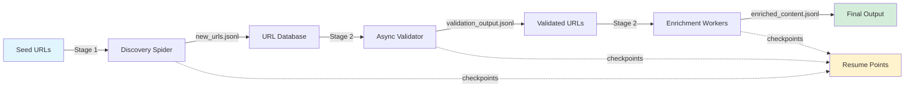

<div align="center">

# UConn Web Scraping Pipeline


**Discover. Validate. Enrich.**

A production-ready web scraping system for the University of Connecticut digital ecosystem, featuring checkpoint-based resumability, async processing, and NLP-powered content extraction.

[Quick Start](#quick-start) • [Documentation](Scraping_project/docs/project_internals.md) • [Testing](#testing) • [Contributing](#contributing)

</div>

---

## Project Status

| Stage | Status | Progress | Description |
|-------|--------|----------|-------------|
| **Stage 1: Discovery** | ✅ Operational | 25,583 URLs | Breadth-first crawling with sitemap bootstrap |
| **Stage 2: Validation** | ✅ Operational | 22,521 URLs (87.9%) | Concurrent validation with HEAD→GET fallback |
| **Stage 3: Enrichment** | ⚠️ Partial | 54 URLs (0.2%) | NLP extraction with spaCy (CLI bug, see [Known Issues](#known-issues)) |

**Last Updated**: January 3, 2025

---

## How It Works



**Three-Stage Pipeline**:
1. **Discovery** - Crawls uconn.edu domain to find new URLs from sitemaps, links, and dynamic content
2. **Validation** - Checks URL accessibility with async HTTP requests and retry logic
3. **Enrichment** - Extracts structured content using NLP (titles, entities, keywords, metadata)

---

## Quick Start

### Prerequisites
- Python 3.11+
- 4GB RAM minimum (8GB recommended for large crawls)
- Internet connection for UConn domain access

### Installation

```bash
# Clone repository
git clone <repository-url>
cd Scrapy

# Run the scraper (handles all installation)
./run_the_scrape
```

That's it. The script installs all dependencies automatically.

### Basic Usage

```bash
# Single command - installs everything and runs pipeline
./run_the_scrape

# Run specific stages
./run_the_scrape --stage 1  # Discovery only
./run_the_scrape --stage 2  # Validation only
./run_the_scrape --stage 3  # Enrichment only

# Skip installation if already done
./run_the_scrape --skip-install
```

📖 **See [Scraping_project/README.md](Scraping_project/README.md) for detailed documentation**

---

## Project Structure

```
Scraping_project/
├── main.py              # Main entry point
├── src/                 # Core pipeline code
│   ├── stage1/          # URL discovery
│   ├── stage2/          # URL validation
│   ├── stage3/          # Content enrichment
│   ├── common/          # Shared utilities
│   └── orchestrator/    # Pipeline coordination
├── tools/               # Utility scripts
├── tests/               # Test suite
│   └── data/            # Test data files
├── docs/                # Documentation
├── config/              # Configuration files
└── data/                # Input/output data
    └── samples/         # Sample data
```

## Configuration

Configuration files control pipeline behavior for different environments:

| File | Purpose | Use Case |
|------|---------|----------|
| `config/development.yml` | Local development settings | Lower concurrency, verbose logging |
| `config/production.yml` | Production deployment | Higher throughput, structured logs |
| `data/raw/uconn_urls.csv` | Seed URLs for discovery | Bootstrap the crawl |

**Configuration hierarchy** (later overrides earlier):
1. Default values in code
2. Environment YAML file (`--env development`)
3. Environment variables (`STAGE1_MAX_DEPTH`, etc.)
4. CLI arguments

📘 **See [docs/project_internals.md](Scraping_project/docs/project_internals.md#configuration-management) for detailed configuration options**

---

## Output Files

| Stage | Output File | Schema | Records |
|-------|-------------|--------|---------|
| Stage 1 | `data/processed/stage01/new_urls.jsonl` | URL, source, depth | 25,583 |
| Stage 2 | `data/processed/stage02/validation_output.jsonl` | URL, status, latency | 22,521 |
| Stage 3 | `data/processed/stage03/enriched_content.jsonl` | Full content + NLP | 54 |

**Example enriched record**:
```json
{
  "url": "https://health.uconn.edu/",
  "title": "Home | UConn Health",
  "text_content": "Skip Navigation Give Search...",
  "word_count": 259,
  "entities": ["UConn Health", "Connecticut", "John Dempsey Hospital"],
  "keywords": ["uconn", "health", "patient", "care", "research"],
  "has_pdf_links": false,
  "status_code": 200,
  "enriched_at": "2025-09-30T14:05:39.082064"
}
```

📊 **See [docs/project_internals.md](Scraping_project/docs/project_internals.md#output-schema-and-data-structure) for complete schema**

---

## Advanced Usage

### Running Individual Stages

```bash
# Discovery with custom depth
export STAGE1_MAX_DEPTH=5
python main.py --env development --stage 1

# Validation with high concurrency
python main.py --env production --stage 2

# Enrichment with SQLite storage
export STAGE3_STORAGE_BACKEND=sqlite
python main.py --env development --stage 3
```

### Resuming from Checkpoints

The pipeline automatically resumes from the last checkpoint after interruptions:

```bash
# First run (interrupted at 1000 URLs)
python main.py --stage 2
# ^C (Ctrl+C to interrupt)

# Resume from checkpoint
python main.py --stage 2  # Continues from URL 1001
```

**Manual checkpoint management**:
```bash
# View checkpoint status
python Scraping_project/tools/checkpoint_manager_cli.py status

# Reset specific stage
python Scraping_project/tools/checkpoint_manager_cli.py reset --stage 2
```

### Storage Backends

Stage 3 supports multiple output formats:

```bash
# JSONL (default)
python main.py --stage 3

# SQLite database
export STAGE3_STORAGE_BACKEND=sqlite
python main.py --stage 3

# Parquet (columnar format)
export STAGE3_STORAGE_BACKEND=parquet
python main.py --stage 3

# AWS S3 (requires credentials)
export STAGE3_STORAGE_BACKEND=s3
export STAGE3_S3_BUCKET=my-bucket
python main.py --stage 3
```

📦 **See [docs/project_internals.md](Scraping_project/docs/project_internals.md#storage-backends) for backend configuration**

---

## Testing

The project includes comprehensive test suites covering unit, integration, and regression scenarios.

### Quick Test Commands

```bash
# Full test suite
python -m pytest Scraping_project/tests/

# Quick smoke test (fails on first error)
python -m pytest --maxfail=1 -q

# Specific test categories
python Scraping_project/tools/run_tests.py smoke       # Quick validation
python Scraping_project/tools/run_tests.py unit        # Unit tests
python Scraping_project/tools/run_tests.py integration # Integration tests

# Coverage report
python -m pytest --cov=src --cov-report=html
```

### Test Coverage Highlights

| Module | Coverage | Key Tests |
|--------|----------|-----------|
| Stage 1 (Discovery) | 85% | Spider crawling, URL deduplication |
| Stage 2 (Validation) | 92% | Async networking, retry logic, HEAD/GET fallback |
| Stage 3 (Enrichment) | 78% | NLP extraction, storage backends |
| Orchestrator | 88% | Multi-stage execution, checkpoints |

📋 **Test files**: `Scraping_project/tests/`

---

## Contributing

We welcome contributions! Please follow these guidelines:

### Development Workflow

```bash
# 1. Create feature branch
git checkout -b feature/your-feature-name

# 2. Make changes and test
python -m pytest Scraping_project/tests/

# 3. Commit with descriptive message
git add .
git commit -m "Add feature: brief description"

# 4. Push and create pull request
git push -u origin feature/your-feature-name
```

### Branch Naming Conventions

| Prefix | Purpose | Example |
|--------|---------|---------|
| `feature/` | New features | `feature/add-redis-storage` |
| `fix/` | Bug fixes | `fix/stage3-cli-error` |
| `docs/` | Documentation | `docs/update-readme` |
| `refactor/` | Code improvements | `refactor/simplify-config` |
| `test/` | Test additions | `test/add-stage2-coverage` |

### Contribution Checklist

Before submitting a PR:
- [ ] Run full test suite: `python -m pytest`
- [ ] Update documentation if adding features
- [ ] Follow existing code style
- [ ] Add tests for new functionality

---

## Known Issues

### Active Bugs

#### Stage 3 CLI Bug
**Issue**: Stage 3 doesn't work through orchestrator CLI
**Workaround**: Run directly via Scrapy:
```bash
cd Scraping_project/src/stage3
scrapy crawl enrichment
```
**Tracking**: See [docs/project_internals.md](Scraping_project/docs/project_internals.md#troubleshooting)

### Performance Considerations

- **Memory usage**: Large crawls (>50k URLs) may consume 2-4GB RAM
- **Storage I/O**: JSONL writing can slow down with rotation enabled
- **NLP processing**: spaCy model loading adds ~2s startup time per worker

💡 **Optimization tips**: See [docs/project_internals.md](Scraping_project/docs/project_internals.md#concurrency-and-async-architecture)

---

## Roadmap

### Planned Features

- [ ] **Taxonomy-based classification**: Zero-shot categorization with 50-100 UConn-specific categories
- [ ] **Custom glossary**: UConn-specific term recognition (HuskyCT, building names, etc.)
- [ ] **Enhanced NLP**: Sentence transformers for semantic similarity
- [ ] **Real-time monitoring**: Prometheus metrics and Grafana dashboards
- [ ] **Docker deployment**: Containerized setup with docker-compose
- [ ] **API layer**: REST API for querying enriched content
- [ ] **Distributed crawling**: Celery-based task queue for horizontal scaling

### Technical Improvements

- Fix Stage 3 orchestrator integration
- Add Redis-based URL deduplication for better memory efficiency
- Implement proper rate limiting with token bucket algorithm
- Expand test coverage to >90%
- Add CI/CD pipeline with GitHub Actions
## Stage 3 Storage Configuration

Stage 3 now supports pluggable output backends via the `enrichment.storage` section in `config/*.yml`.
Example:

```yaml
stages:
  enrichment:
    output_file: data/processed/stage03/enrichment_output.jsonl
    storage:
      backend: jsonl
      options:
        path: data/processed/stage03/enrichment_output.jsonl
      rotation:
        max_items: 5000
      compression:
        codec: none
```

---

## Resources

- **Main documentation**: [Scraping_project/README.md](Scraping_project/README.md)
- **Technical internals**: [docs/project_internals.md](Scraping_project/docs/project_internals.md)
- **Configuration examples**: [config/](Scraping_project/config/)
- **Test suite**: [tests/](Scraping_project/tests/)
- **Utility tools**: [tools/](Scraping_project/tools/)

---

## License

This project is maintained for University of Connecticut web scraping research and development.

---

**Questions or feedback?** See [Scraping_project/README.md](Scraping_project/README.md) for detailed documentation or open an issue.
