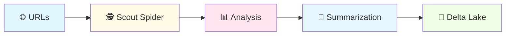
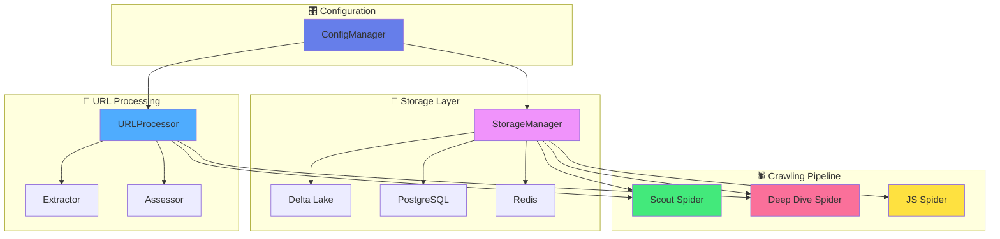
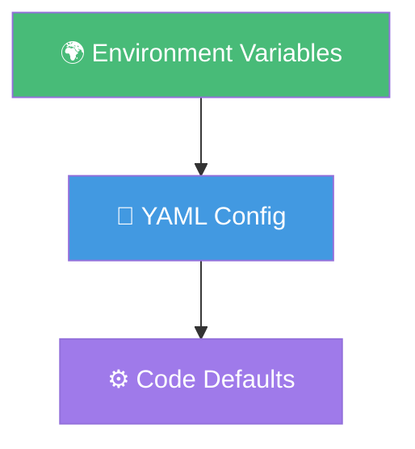

<div align="center">

# 🕷️ Web Scraping Pipeline

### *Intelligent, scalable web crawling with real-time monitoring*

[](https://github.com/BenjaminSRussell/Scrapy/actions/workflows/main.yml)
[](https://www.python.org/downloads/)
[](https://scrapy.org/)
[](LICENSE)

[Quick Start](#-quick-start) • [Features](#-features) • [Architecture](#-architecture) • [Monitoring](#-monitoring) • [Docs](ARCHITECTURE.md)

</div>

---

## 🎯 What It Does

Multi-stage intelligent web crawler that discovers, analyzes, and summarizes web content at scale.


```mermaid
graph LR
    A[🌐 URLs] --> B[🕵️ Scout Spider]
    B --> C[📊 Analysis]
    C --> D[🤖 Summarization]
    D --> E[💾 Delta Lake]

    style A fill:#e1f5ff
    style B fill:#fff9e6
    style C fill:#ffe6f0
    style D fill:#e6f7ff
    style E fill:#f0ffe6
```

---

## ✨ Features

<table>
<tr>
<td width="50%">

### 🚀 **Intelligent Crawling**
- Smart URL prioritization
- JS-heavy page detection
- Adaptive rate limiting
- Domain-aware routing

</td>
<td width="50%">

### 📊 **Real-Time Monitoring**
- Live Grafana dashboards
- Prometheus metrics
- Circuit breaker patterns
- Health checks

</td>
</tr>
<tr>
<td width="50%">

### 💾 **Robust Storage**
- Delta Lake for raw data
- PostgreSQL for metrics
- Redis for queues
- Unified interface

</td>
<td width="50%">

### 🧪 **Production Ready**
- 90%+ test coverage
- Type-safe configuration
- Docker + Kubernetes
- Auto-scaling support

</td>
</tr>
</table>

---

## 🚀 Quick Start

### One Command Setup

```bash
python start.py
```

That's it! 🎉 The pipeline starts with:
- ✅ All services running
- ✅ Monitoring enabled
- ✅ Sample URLs loaded

### View Your Dashboard

Open **http://localhost:3000** (login: `admin` / `admin`)

<div align="center">

| Service | URL | Purpose |
|---------|-----|---------|
| 📊 **Grafana** | `localhost:3000` | Visual dashboards |
| 🔥 **Prometheus** | `localhost:9091` | Metrics database |
| 🕷️ **Spider Metrics** | `localhost:9410` | Spider stats |
| 📮 **Redis Metrics** | `localhost:9090` | Queue depth |

</div>

---

## 🏗️ Architecture

### Three-Tier Manager System

<div align="center">


```mermaid
graph TB
    subgraph "🎛️ Configuration"
        CM[ConfigManager]
    end

    subgraph "💾 Storage Layer"
        SM[StorageManager]
        DL[Delta Lake]
        PG[PostgreSQL]
        RD[Redis]
        SM --> DL
        SM --> PG
        SM --> RD
    end

    subgraph "🔗 URL Processing"
        UP[URLProcessor]
        EX[Extractor]
        AS[Assessor]
        UP --> EX
        UP --> AS
    end

    subgraph "🕷️ Crawling Pipeline"
        S1[Scout Spider]
        S2[Deep Dive Spider]
        S3[JS Spider]
    end

    CM --> SM
    CM --> UP
    SM --> S1
    SM --> S2
    SM --> S3
    UP --> S1
    UP --> S2

    style CM fill:#667eea
    style SM fill:#f093fb
    style UP fill:#4facfe
    style S1 fill:#43e97b
    style S2 fill:#fa709a
    style S3 fill:#fee140
```

</div>

### 📁 Project Structure

```
📦 Scraping Pipeline
├── 🎛️  src/common/          # Core managers (Config, Storage, URL)
├── 🕷️  src/stage1/          # Discovery spiders (Scout, DeepDive, JS)
├── 📊 src/stage2/          # Page analysis workers
├── 🤖 src/stage3/          # Summarization workers
├── 📈 monitoring/          # Prometheus + Grafana configs
├── 🦀 kafka-delta-ingest/  # Rust ingestion service
├── ☸️  k8s/                # Kubernetes deployments
└── 🧪 tests/              # Comprehensive test suite
```

---

## 🕷️ Stage 1: Discovery

<table>
<tr>
<td width="33%">

### 🔍 Scout Spider
**Fast discovery**

- Aggressive crawling
- Broad URL discovery
- Queue population
- 1000+ req/min

</td>
<td width="33%">

### 🎯 Deep Dive
**Hidden URLs**

- Data attributes
- JSON-LD extraction
- API endpoints
- Value assessment

</td>
<td width="33%">

### ⚡ JS Spider
**Dynamic content**

- Playwright rendering
- SPA handling
- Lazy loading
- Network intercept

</td>
</tr>
</table>

### Usage

```python
from src.common.config_manager import ConfigManager
from src.common.storage_manager import StorageManager
from src.common.url_processor import URLProcessor

# Single source of truth
config = ConfigManager.get_instance()

# Unified storage
storage = StorageManager.get_instance()
storage.delta.write_batch('table', records)

# Smart URL processing
processor = URLProcessor(base_url, domains)
urls = processor.discover_and_assess(response, min_value_score=40)
```

---

## 📊 Monitoring

### Live Dashboards

<div align="center">

| Dashboard | Metrics | Update Frequency |
|-----------|---------|------------------|
| **Spider Overview** | URLs/min, Success rate, Queue depth | Real-time |
| **Storage Health** | Write throughput, Table sizes, Errors | 10s |
| **System Resources** | CPU, Memory, Disk I/O | 5s |
| **Quality Metrics** | Content scores, Dedup rate, JS confidence | Real-time |

</div>

### Quick Commands

```bash
# View all services
docker-compose ps

# Follow spider logs
docker-compose logs -f scrapy-app

# Check system health
./scripts/diagnose_issues.sh

# Reset everything
python start.py --reset-delta
```

---

## 🛠️ Configuration

### Three-Level Hierarchy

<div align="center">


```mermaid
graph TD
    A[🌍 Environment Variables] --> B[📝 YAML Config]
    B --> C[⚙️ Code Defaults]

    style A fill:#48bb78,color:#fff
    style B fill:#4299e1,color:#fff
    style C fill:#9f7aea,color:#fff
```

**Highest Priority** ➜ **Lowest Priority**

</div>

### Example Configuration

```yaml
# config.yml
redis:
  host: localhost
  port: 6379

stage1:
  batch_size: 50
  js_confidence_threshold: 0.7

stage2:
  max_workers: 100
  min_word_count: 50
```

Override with environment variables:
```bash
export REDIS_HOST=production-redis
export DB_PASSWORD=secret123
```

Access in code:
```python
config = ConfigManager.get_instance()
redis_host = config.redis.host          # Type-safe!
batch_size = config.stage1.batch_size   # IDE autocomplete
```

📚 **[Full Configuration Guide →](ARCHITECTURE.md)**

---

## 💾 Storage

### Unified Interface

```python
storage = StorageManager.get_instance()

# Delta Lake - Raw data
storage.delta.write('stage1_discovery', records)
data = storage.delta.read('stage1_discovery')

# PostgreSQL - Metrics
storage.postgres.log_error('spider_name', error)
metrics = storage.postgres.get_performance_metrics()

# Redis - Queues
storage.redis.mark_url_seen('https://example.com')
storage.redis.enqueue('queue_name', item)

# Health checks
health = storage.health_check()
# {'delta': True, 'postgres': True, 'redis': True}
```

### Auto-cleanup

```python
# Context manager automatically closes connections
with StorageManager() as storage:
    storage.delta.write_batch('table', data)
    # Connections closed on exit
```

---

## 🔗 URL Processing

### All-in-One

```python
processor = URLProcessor('https://example.com', ['example.com'])

# Discover + assess in one call
urls = processor.discover_and_assess(
    response,
    min_value_score=40  # Filter low-value URLs
)

# Each URL includes:
# - value_score (0-100)
# - recommended_spider ('scout'/'depth'/'js')
# - reasons (why this score)
```

### Smart Operations

<table>
<tr>
<td>

**Normalization**
```python
# Removes tracking, lowercases
url = processor.normalize_url(
    'https://Example.com?utm_source=test'
)
# → 'https://example.com'
```

</td>
<td>

**Validation**
```python
# Filters unwanted URLs
should_follow = processor.should_follow_url(
    'https://example.com/login'
)
# → False
```

</td>
</tr>
<tr>
<td>

**Deduplication**
```python
# Removes duplicates
unique = processor.deduplicate_urls([
    'url1', 'url2', 'url1'
])
# → ['url1', 'url2']
```

</td>
<td>

**Prioritization**
```python
# Calculates crawl priority
priority = processor.calculate_priority(
    url, value_score=85, depth=2
)
# → 75 (0-100)
```

</td>
</tr>
</table>

---

## ☸️ Kubernetes Deployment

### Production Ready

```bash
# Deploy full pipeline
python start.py --env k8s --stage pipeline

# Deploy individual stages
python start.py --env k8s --stage stage1

# Scaled deployment
python start.py --env k8s --stage all-stages \
  --release-prefix prod \
  --namespace-prefix scraping
```

### Auto-Scaling

- Horizontal pod autoscaling enabled
- Resource limits enforced
- Rolling updates supported
- Health checks configured

📚 **[Kubernetes Guide →](k8s/DEPLOYMENT_GUIDE.md)**

---

## 🧪 Testing

### Comprehensive Coverage

<div align="center">

| Component | Coverage | Tests |
|-----------|----------|-------|
| **ConfigManager** | 95%+ | 20+ |
| **StorageManager** | 90%+ | 30+ |
| **URLProcessor** | 95%+ | 40+ |
| **Spiders** | 85%+ | 50+ |

</div>

### Run Tests

```bash
# All tests
pytest

# Specific component
pytest tests/unit/common/test_config_manager.py -v

# With coverage
pytest --cov=src --cov-report=html

# Fast tests only
pytest -m "not slow"
```

---

## 🎓 Learning Resources

<table>
<tr>
<td width="50%">

### 📖 Documentation
- **[Architecture Guide](ARCHITECTURE.md)** - Detailed technical docs
- **[Refactoring Summary](REFACTORING_SUMMARY.md)** - Recent changes
- **[K8s Deployment](k8s/DEPLOYMENT_GUIDE.md)** - Production setup

</td>
<td width="50%">

### 🎯 Examples
- **[ConfigManager Tests](tests/unit/common/test_config_manager.py)** - Usage examples
- **[BaseSpider](src/stage1/base_spider.py)** - Integration patterns
- **[Worker Template](src/stage2/stage2_worker.py)** - Worker structure

</td>
</tr>
</table>

---

## 🔧 Development

### Setup

```bash
# Create virtual environment
python -m venv .venv
source .venv/bin/activate  # or `.venv\Scripts\activate` on Windows

# Install dependencies
pip install -r requirements.txt
pip install -r dev-requirements.txt

# Run tests
pytest

# Code quality
ruff check .
mypy src/
```

### Pre-commit Hooks

```bash
# Install hooks
pre-commit install

# Run manually
pre-commit run --all-files
```

### Common Tasks

```bash
# Reseed data
python reseed.py

# Load new URLs
python cli.py load_seeds data/urls.csv

# Reset Delta tables
python start.py --reset-delta

# View logs
docker-compose logs -f scrapy-app

# Enter container
docker-compose exec scrapy-app bash
```

---

## 🐛 Troubleshooting

### Quick Diagnostics

```bash
# System health check
./scripts/diagnose_issues.sh

# View all services
docker-compose ps

# Check specific service
docker-compose logs kafka-delta-ingestor

# Verify storage health
python -c "from src.common.storage_manager import StorageManager; \
           print(StorageManager.get_instance().health_check())"
```

### Common Issues

<details>
<summary><b>🔴 Spiders not starting</b></summary>

Check seed URLs are loaded:
```bash
docker-compose exec scrapy-app python cli.py list_seeds
```

Reload if needed:
```bash
python start.py --reset-delta
```

</details>

<details>
<summary><b>🔴 Grafana dashboard empty</b></summary>

Reset Grafana:
```bash
./scripts/reset_grafana_complete.sh
```

Wait 30s, then reload dashboard.

</details>

<details>
<summary><b>🔴 High memory usage</b></summary>

Adjust batch sizes in `config.yml`:
```yaml
stage1:
  batch_size: 25  # Reduce from 50
```

Restart services:
```bash
python shutdown.py && python start.py
```

</details>

---

## 📊 Performance

### Benchmarks

<div align="center">

| Metric | Scout Spider | Deep Dive | JS Spider |
|--------|--------------|-----------|-----------|
| **Throughput** | 1000+ URLs/min | 100+ URLs/min | 20+ URLs/min |
| **Concurrent Requests** | 1024 | 32 | 20 |
| **Memory Usage** | ~2GB | ~1GB | ~4GB |
| **Discovery Rate** | 95%+ | 85%+ | 100% |

</div>

### Optimization Tips

- 🎯 Use `min_value_score` to filter low-value URLs early
- 🔄 Enable Redis queue for distributed crawling
- 📊 Monitor queue depth to prevent backpressure
- ⚡ Adjust `batch_size` based on available memory

---

## 🤝 Contributing

We welcome contributions! Here's how:

1. **Fork** the repository
2. **Create** a feature branch (`git checkout -b feature/amazing`)
3. **Add tests** for new functionality
4. **Ensure** all tests pass (`pytest`)
5. **Commit** with clear messages
6. **Push** to your fork
7. **Open** a Pull Request

### Code Standards

- ✅ Type hints required
- ✅ Tests required (90%+ coverage)
- ✅ Documentation required
- ✅ Ruff linting passes
- ✅ Pre-commit hooks pass

---

## 📝 License

MIT License - see [LICENSE](LICENSE) for details.

---

## 🙏 Acknowledgments

Built with these amazing tools:

<div align="center">

| Tool | Purpose |
|------|---------|
| 🕷️ [Scrapy](https://scrapy.org/) | Web crawling framework |
| 🦀 [Delta Lake](https://delta.io/) | Data lake storage |
| 📊 [Grafana](https://grafana.com/) | Visualization |
| 🔥 [Prometheus](https://prometheus.io/) | Metrics collection |
| 🎭 [Playwright](https://playwright.dev/) | Browser automation |
| 🐘 [PostgreSQL](https://postgresql.org/) | Relational database |
| 🔴 [Redis](https://redis.io/) | In-memory store |

</div>

---

<div align="center">

### 🚀 Start Crawling Now!

```bash
python start.py
```

**Questions?** Open an [issue](https://github.com/benjaminrussell/Scraping_project/issues) • **Star** ⭐ if you find this useful!

Made with ❤️ and lots of ☕

</div>
