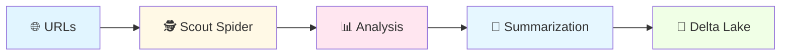
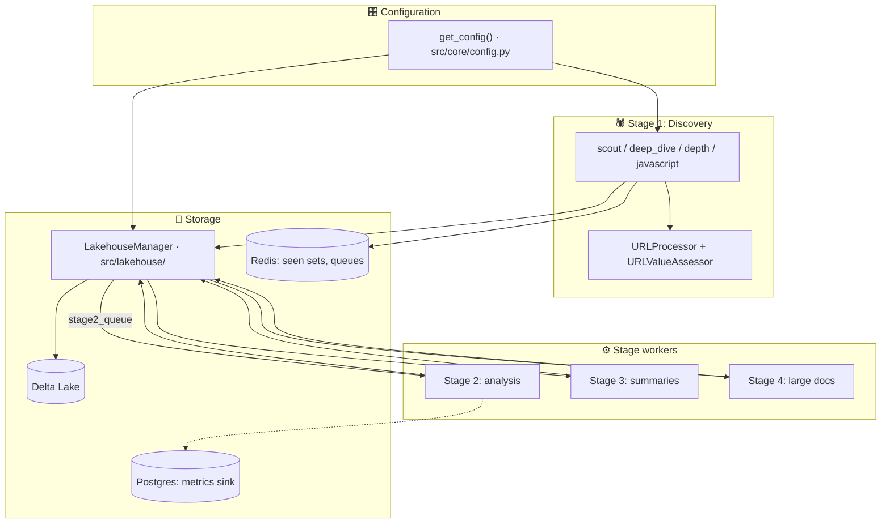

<div align="center">

# 🕷️ Web Scraping Pipeline

### *Intelligent, scalable web crawling with real-time monitoring*

[](https://github.com/BenjaminSRussell/Scrapy/actions/workflows/main.yml)
[](https://www.python.org/downloads/)
[](https://scrapy.org/)
[](LICENSE)

[Quick Start](#-quick-start) • [Features](#-features) • [Architecture](#-architecture) • [Monitoring](#-monitoring) • [Guides](Scraping_project/docs/guides/README.md) • [Docs](Scraping_project/README.md#architecture)

</div>

---

## 🎯 What It Does

Multi-stage intelligent web crawler that discovers, analyzes, and summarizes web content at scale.


```mermaid
graph LR
    A[🌐 URLs] --> B[🕵️ Scout Spider]
    B --> C[📊 Analysis]
    C --> D[🤖 Summarization]
    D --> E[💾 Delta Lake]

    style A fill:#e1f5ff
    style B fill:#fff9e6
    style C fill:#ffe6f0
    style D fill:#e6f7ff
    style E fill:#f0ffe6
```

---

## ✨ Features

<table>
<tr>
<td width="50%">

### 🚀 **Intelligent Crawling**
- Smart URL prioritization
- JS-heavy page detection
- Adaptive rate limiting
- Domain-aware routing

</td>
<td width="50%">

### 📊 **Real-Time Monitoring**
- Live Grafana dashboards
- Prometheus metrics
- Circuit breaker patterns
- Health checks

</td>
</tr>
<tr>
<td width="50%">

### 💾 **Robust Storage**
- Delta Lake for all pipeline data
- Redis for seen-URL sets and queues
- PostgreSQL metrics sink (optional)
- One `LakehouseManager` entry point

</td>
<td width="50%">

### 🧪 **Tested & Deployable**
- Unit + integration suites in CI
- Config precedence: env ➜ YAML ➜ defaults
- Docker Compose + Helm chart
- Horizontal pod autoscaling
</td>
</tr>
</table>

---

## 🚀 Quick Start

> **Always work from `Scraping_project/`.** `start.py`, `cli.py`, `requirements*.txt`, `pytest.ini`,
> `docker-compose.yml` and `scrapy.cfg` all live there, so every command in this README assumes you
> ran `cd Scraping_project` first (#334). From the clone root, `python start.py` fails;
> `python Scraping_project/start.py` or `cd Scraping_project && python start.py` works.

### One Command Setup

```bash
cd Scraping_project
python start.py
```

That's it! 🎉 The pipeline starts with:
- ✅ All services running
- ✅ Monitoring enabled
- ✅ Sample URLs loaded

### View Your Dashboard

Open **http://localhost:3000** (user `admin`; the password is `GRAFANA_ADMIN_PASSWORD` from `.env` and defaults to `admin` for local dev only)

<div align="center">

| Service | URL | Purpose |
|---------|-----|---------|
| 📊 **Grafana** | `localhost:3000` | Visual dashboards |
| 🔥 **Prometheus** | `localhost:9090` | Metrics database (published by `docker-compose.yml`) |
| 🕷️ **Spider Metrics** | `scraper:9410` | Spider stats (scraped by Prometheus inside the compose network) |
| ⚙️ **Stage worker / Redis / Postgres metrics** | `stage{2,3,4}-worker:9430`, `redis-exporter:9121`, `postgres-exporter:9187` | Scrape targets in `monitoring/prometheus.yml` (not published to the host) |

</div>

---

## 🏗️ Architecture

<div align="center">


```mermaid
graph TB
    subgraph "🎛️ Configuration"
        CFG["get_config() · src/core/config.py"]
    end

    subgraph "🕷️ Stage 1: Discovery"
        S1["scout / deep_dive / depth / javascript"]
        UP["URLProcessor + URLValueAssessor"]
        S1 --> UP
    end

    subgraph "⚙️ Stage workers"
        W2["Stage 2: analysis"]
        W3["Stage 3: summaries"]
        W4["Stage 4: large docs"]
    end

    subgraph "💾 Storage"
        LH["LakehouseManager · src/lakehouse/"]
        DL[(Delta Lake)]
        RD[(Redis: seen sets, queues)]
        PG[(Postgres: metrics sink)]
        LH --> DL
    end

    CFG --> S1
    CFG --> LH
    S1 --> LH
    S1 --> RD
    LH -- stage2_queue --> W2
    W2 --> LH
    LH --> W3
    LH --> W4
    W3 --> LH
    W4 --> LH
    W2 -.-> PG
```

</div>

### 📁 Project Structure

```
📦 Scraping_project/
├── 🎛️  src/core/            # config.py: get_config(), stage worker settings
├── 💾 src/lakehouse/       # LakehouseManager, SeedManager (Delta Lake)
├── 🧰 src/common/          # URL value assessor, scoring, crawl data helpers
├── 🕷️  src/stage1/          # scout_spider.py, processors/ (URLProcessor), middlewares/, experimental/ spiders
├── 📊 src/stage2/          # page analysis worker
├── 🤖 src/stage3/          # summarization worker
├── 📄 src/stage4/          # large-document (PDF) processing
├── ⚙️  src/workers/         # container entrypoints: python -m src.workers.stageN_worker
├── 📈 monitoring/          # Prometheus rules + Grafana dashboards
├── 🦀 kafka-delta-ingest/  # Rust ingestion service
├── ☸️  k8s/                # Helm chart
├── 📚 docs/guides/         # configuration, running, monitoring, data usage
└── 🧪 tests/              # unit / integration / e2e suites
```

---

## 🕷️ Stage 1: Discovery

<table>
<tr>
<td width="33%">

### 🔍 Scout Spider
**Fast discovery**

- Aggressive crawling
- Broad URL discovery
- Queue population
- 1000+ req/min

</td>
<td width="33%">

### 🎯 Deep Dive
**Hidden URLs**

- Data attributes
- JSON-LD extraction
- API endpoints
- Value assessment

</td>
<td width="33%">

### ⚡ JS Spider
**Dynamic content**

- Playwright rendering
- SPA handling
- Lazy loading
- Network intercept

</td>
</tr>
</table>

### Spider names and modules

Run spiders by their **scrapy name** (not the file name) from `Scraping_project/` (#489):

| `scrapy crawl …` | Module | Status |
|---|---|---|
| `scout` | `src/stage1/scout_spider.py` | default discovery spider |
| `depth` | `src/stage1/experimental/depth_spider.py` | experimental |
| `javascript` | `src/stage1/experimental/js_spider.py` | experimental (Playwright) |
| `deep_dive` | `src/stage1/experimental/deep_dive_spider.py` | experimental |
| `base` | `src/stage1/experimental/base_spider.py` | experimental base class |

```bash
cd Scraping_project
scrapy list            # base, deep_dive, depth, javascript, scout
scrapy crawl scout     # not `scrapy crawl scout_spider`
```

### Usage

```python
from src.core.config import get_config
from src.lakehouse.lakehouse_manager import LakehouseManager
from src.stage1.processors.url_processor import URLProcessor

config = get_config()                                  # config.yml singleton
lake = LakehouseManager.get_instance()                 # Delta Lake tables
processor = URLProcessor("https://www.uconn.edu/", config.get("stage1.allowed_domains", ["uconn.edu"]))
```

Crawl another domain without editing config: `scrapy crawl scout -a allowed_domains=example.org -a start_urls=https://www.example.org/`
([Running guide](Scraping_project/docs/guides/RUNNING.md)).

---

## 📊 Monitoring

### Live Dashboards

Grafana at **http://localhost:3000** provisions these from `monitoring/dashboards/`:

| Dashboard | What it shows |
|-----------|---------------|
| **Scraping Pipeline Health** (`/d/scraping-pipeline-health`) | Items/s, error ratio, circuit breakers, Delta write queue, per-stage throughput, Stage 1 discovery, error tracking, storage & infrastructure |
| **Unified Dashboard** | Kafka consumer lag, off-site link discovery |

Prometheus (http://localhost:9090) evaluates 41 alert rules from `monitoring/alerting_rules.yml`.
📚 **[Monitoring guide →](Scraping_project/docs/guides/MONITORING.md)**

### Quick Commands

```bash
# from Scraping_project/
# View all services
docker-compose ps

# Follow spider logs
docker-compose logs -f scraper

# Check system health
./scripts/diagnose_issues.sh

# Reset everything
python start.py --reset-delta
```

---

## 🛠️ Configuration

### Precedence

**Environment variable** (where one exists) ➜ **`config.yml`** ➜ **default in code**

### Example Configuration

```yaml
# config.yml
redis:
  host: localhost
  port: 6379

stage1:
  batch_size: 50
  js_confidence_threshold: 0.7

stage2:
  max_workers: 100
  min_word_count: 50
```

Override with environment variables (only the keys that have one; see the guide):
```bash
export REDIS_HOST=production-redis
export DB_PASSWORD=...          # never commit secrets to config.yml
export DELTA_LAKE_PATH=/data/delta
```

Access in code:
```python
from src.core.config import get_config

config = get_config()
redis_host = config.get("redis.host", "localhost")      # dot-notation keys
batch_size = config.get("stage1.batch_size", 50)
```

📚 **[Full Configuration Guide →](Scraping_project/docs/guides/CONFIGURATION.md)** (every section and environment variable)

---

## 💾 Storage

All pipeline data lives in Delta Lake tables under `DELTA_LAKE_PATH` (default `./data/delta_lake`),
managed by `LakehouseManager` (`src/lakehouse/lakehouse_manager.py`). Redis holds the seen-URL sets and
queues; Postgres is an optional metrics/error sink.

```python
from src.lakehouse.lakehouse_manager import LakehouseManager

lake = LakehouseManager.get_instance()

# Write (async by default; async_write=False commits before returning)
lake.write("stage1_discovery", [{"url": "https://www.uconn.edu/", "url_hash": "abc"}], async_write=False)

# Read with partition pruning, or count
rows = lake.read("stage1_discovery", filters=[("domain", "=", "uconn.edu")], columns=["url"])
total = lake.count("stage1_discovery")

# Stream a table to CSV / JSON lines / Parquet
lake.export("stage1_discovery", "exports/discovery.parquet", format="parquet")

# Drain the write queue and stop the background writer
lake.shutdown()
```

📚 **[Data usage guide →](Scraping_project/docs/guides/DATA_USAGE.md)** (tables, pandas/deltalake queries, time travel, export)

---

## 🔗 URL Processing

`URLProcessor` (`src/stage1/processors/url_processor.py`) is what the spiders use to discover, canonicalize,
filter and score links.

```python
from scrapy.http import HtmlResponse

from src.stage1.processors.url_processor import URLProcessor

processor = URLProcessor(base_url="https://www.uconn.edu/", allowed_domains=["uconn.edu"])

# Discover + assess the links on a page in one call
response = HtmlResponse(url="https://www.uconn.edu/", body=b'<a href="/research/">Research</a>', encoding="utf-8")
urls = processor.discover_and_assess(response, min_value_score=40)
# [{'url': 'https://www.uconn.edu/research', 'value_score': 70, 'recommended_spider': 'scout', 'reasons': [...], ...}]

# Canonicalize: lowercases, drops tracking params and fragments, sorts the query
processor.normalize_url("https://WWW.UConn.edu/About/?utm_source=x&b=2&a=1#top")
# 'https://www.uconn.edu/about?a=1&b=2'

# Filter static assets and unwanted URLs
processor.should_follow_url("https://www.uconn.edu/logo.png")    # False

# Deduplicate by canonical form
processor.deduplicate_urls(["https://www.uconn.edu/a", "https://www.uconn.edu/a?utm_source=x"])
# ['https://www.uconn.edu/a']

# Crawl priority (0-100)
processor.calculate_priority("https://www.uconn.edu/research/labs", value_score=85, depth=2)
# 75
```

The scoring itself lives in `URLValueAssessor` (`src/common/url_value_assessor.py`).

---

## ☸️ Kubernetes Deployment

### Production Ready

```bash
# from Scraping_project/
# Deploy full pipeline
python start.py --env k8s --stage pipeline

# Deploy individual stages
python start.py --env k8s --stage stage1

# Scaled deployment
python start.py --env k8s --stage all-stages \
  --release-prefix prod \
  --namespace-prefix scraping
```

`--stage` only applies to `--env k8s`. `python start.py` (local) always runs
`docker-compose up -d` for every Compose service and prints the services it found;
start a subset with `docker-compose up -d <service>`. The Helm chart deploys
Stages 1–3 only (there is no Stage 4 PDF/OCR workload yet), so run Stage 4 with
Compose (`stage4-worker`).

### Auto-Scaling

- Horizontal pod autoscaling enabled
- Resource limits enforced
- Rolling updates supported
- Health checks configured

📚 **[Kubernetes Guide →](Scraping_project/DEPLOYMENT.md#kubernetes-deployment)**

---

## 🧪 Testing

CI (`.github/workflows/main.yml`) runs ruff, mypy, bandit and the unit/integration suite on every PR.
Coverage is measured but not gated in CI; `pytest.ini` sets `fail_under = 70` for local `--cov` runs.

### Run Tests

```bash
# from Scraping_project/
# What CI runs
pytest tests/ -m "not slow and not kafka and not performance"

# Specific component
pytest tests/unit/common/test_config_manager.py -v

# With coverage
pytest --cov=src --cov-report=html

# Fast tests only
pytest -m "not slow"
```

---

## 🎓 Learning Resources

<table>
<tr>
<td width="50%">

### 📖 Documentation
- **[Guides](Scraping_project/docs/guides/README.md)**: [Configuration](Scraping_project/docs/guides/CONFIGURATION.md) • [Running](Scraping_project/docs/guides/RUNNING.md) (other domains, resuming) • [Monitoring](Scraping_project/docs/guides/MONITORING.md) • [Data usage](Scraping_project/docs/guides/DATA_USAGE.md) (Delta Lake queries, CSV/Parquet export)
- **[Architecture Guide](Scraping_project/README.md#architecture)**: detailed technical docs
- **[Evolution Roadmap](Scraping_project/EVOLUTION_ROADMAP.md)**: recent and planned changes
- **[K8s Deployment](Scraping_project/DEPLOYMENT.md#kubernetes-deployment)**: production setup (see also [k8s/README.md](Scraping_project/k8s/README.md))

</td>
<td width="50%">

### 🎯 Examples
- **[Config tests](Scraping_project/tests/unit/common/test_config_manager.py)**: `get_config()` usage
- **[BaseSpider](Scraping_project/src/stage1/experimental/base_spider.py)**: spider integration patterns
- **[Worker Template](Scraping_project/src/stage2/stage2_worker.py)**: worker structure

</td>
</tr>
</table>

---

## 🔧 Development

### Setup

```bash
cd Scraping_project

# Create virtual environment
python -m venv .venv
source .venv/bin/activate  # or `.venv\Scripts\activate` on Windows

# Install dependencies
pip install -r requirements.txt
pip install -r dev-requirements.txt

# Run tests
pytest

# Code quality
ruff check .
mypy src/
```

### Pre-commit Hooks

```bash
# from Scraping_project/
# Install hooks
pre-commit install

# Run manually
pre-commit run --all-files
```

### Common Tasks

```bash
# from Scraping_project/
# Reseed from the bundled CSV (or --csv path/to/urls.csv)
python reseed.py

# Add one seed URL
python cli.py seeds add https://www.example.org/ --note "why" --actor me

# Reset Delta tables
python start.py --reset-delta

# View logs
docker-compose logs -f scraper

# Enter container
docker-compose exec scraper bash
```

---

## 📂 Repository Layout & Ignore Policy

### Single Authoritative .gitignore

This repository uses a **single root-level `.gitignore`** file for all ignore rules. All nested `.gitignore` files have been consolidated into `/.gitignore` for easier maintenance and consistency.

### What's Ignored

The root `.gitignore` covers:
- **Python artifacts**: bytecode, wheels, eggs, build outputs
- **Virtual environments**: `.venv/`, `venv/`, `ENV/`, `env/`
- **IDE files**: `.idea/`, `.vscode/`, `*.iml`, swap files
- **Data & logs**: `data/**`, `logs/**`, `*.log`, `*.db`
- **Test artifacts**: `.pytest_cache/`, `.coverage`, `htmlcov/`
- **Secrets**: `.env*`, `*.pem`, `*.key`, `credentials.json`
- **Database files**: `*.sqlite`, `*.db-shm`, `*.db-wal`
- **Delta Lake**: `data/delta_lake/`, `_delta_log/`, checkpoints
- **Kafka/Streaming**: `kafka-logs/`, `zookeeper/`
- **Docker overrides**: `docker-compose.override.yml`
- **Monitoring data**: `prometheus-data/`, `grafana-data/`
- **Temp files**: `tmp/`, `temp/`, `*.tmp`, `*.bak`
- **macOS artifacts**: `.DS_Store`, `._*`
- **Rust/Cargo**: `target/`, `.cargo/`, `*.rs.bk`
- **direnv**: `.envrc`, `.direnv/` (commit only `Scraping_project/.envrc.example`)

### What's Tracked (Whitelisted)

Important project files are explicitly whitelisted:
- `package.json`, `package-lock.json` (Node dependencies)
- `tsconfig.json` (TypeScript config)
- `Cargo.toml`, `Cargo.lock` (Rust dependencies)
- `.devcontainer/devcontainer.json` (dev container; `*.json` is otherwise ignored)

View the complete ignore rules in [.gitignore](.gitignore).

---

## 🐛 Troubleshooting

### Quick Diagnostics

```bash
# from Scraping_project/
# System health check
./scripts/diagnose_issues.sh

# View all services
docker-compose ps

# Check specific service
docker-compose logs stage2-worker

# Delta table row/file counts
python cli.py health

### Common Issues

<details>
<summary><b>🔴 Spiders not starting</b></summary>

Check seed URLs are loaded:
```bash
# from Scraping_project/
docker-compose exec scraper python cli.py seeds list --active-only
```

Reload if needed:
```bash
# from Scraping_project/
python start.py --reset-delta
```

</details>

<details>
<summary><b>🔴 Grafana dashboard empty</b></summary>

Reset Grafana:
```bash
./scripts/reset_grafana_complete.sh
```

Wait 30s, then reload dashboard.

</details>

<details>
<summary><b>🔴 High memory usage</b></summary>

Adjust batch sizes in `config.yml`:
```yaml
stage1:
  batch_size: 25  # Reduce from 50
```

Restart services:
```bash
# from Scraping_project/
python shutdown.py && python start.py
```

</details>

---

## 📊 Performance

### Design targets

These are the design targets used when tuning the spiders' default settings. They are not measured benchmarks,
because real throughput depends on the target site, robots.txt/Crawl-delay, network and hardware.
Measure your own run on the Grafana **Scraping Pipeline Health** dashboard
(Items Scraped / s, URLs Processed per Second by Stage, Response Time p95).

| Spider | Concurrency source | Notes |
|--------|--------------------|-------|
| **scout** | `stage1.spiders.scout` in `config.yml` | broad, fast discovery |
| **deep_dive** | `stage1.spiders.deep_dive` | conservative, extracts hidden URLs |
| **javascript** | `stage1.spiders.javascript` + `PLAYWRIGHT_MAX_CONTEXTS` | Playwright rendering; memory-bound |

### Optimization Tips

- 🎯 Use `min_value_score` (`URLProcessor.discover_and_assess`) to drop low-value URLs early
- 🔄 Enable the Redis queue (`stage1.use_redis_queue`) for distributed crawling
- 📊 Watch the Redis queue depth and Delta Write Queue Depth panels for backpressure
- ⚡ Adjust `batch_size` based on available memory

---

## 🤝 Contributing

We welcome contributions! Here's how:

1. **Fork** the repository
2. **Create** a feature branch (`git checkout -b feature/amazing`)
3. **Add tests** for new functionality
4. **Ensure** all tests pass (`pytest`)
5. **Commit** with clear messages
6. **Push** to your fork
7. **Open** a Pull Request

See **[CONTRIBUTING.md](CONTRIBUTING.md)** for setup (venv, dev container, direnv),
the exact CI commands, and the release process.

| Policy | |
|---|---|
| 🔒 [SECURITY.md](SECURITY.md) | report vulnerabilities privately; supported versions |
| 🤝 [CODE_OF_CONDUCT.md](CODE_OF_CONDUCT.md) | Contributor Covenant 2.1 |
| 📜 [CHANGELOG.md](CHANGELOG.md) | what changed, by release ([releasing](docs/RELEASING.md)) |
| 🧭 [docs/adr/](docs/adr/README.md) | architecture decision records |

### Code Standards

- ✅ Type hints (mypy runs in CI)
- ✅ Tests for new behaviour; `pytest.ini` sets a 70% coverage floor for local `--cov` runs
- ✅ Docs updated with behaviour changes ([guides](Scraping_project/docs/guides/README.md))
- ✅ Ruff, mypy and bandit pass (the same commands as CI; see [CONTRIBUTING.md](CONTRIBUTING.md))
- ✅ Pre-commit hooks pass

---

## 📝 License

MIT License - see [LICENSE](LICENSE) for details.

---

## 🙏 Acknowledgments

Built with these amazing tools:

<div align="center">

| Tool | Purpose |
|------|---------|
| 🕷️ [Scrapy](https://scrapy.org/) | Web crawling framework |
| 🦀 [Delta Lake](https://delta.io/) | Data lake storage |
| 📊 [Grafana](https://grafana.com/) | Visualization |
| 🔥 [Prometheus](https://prometheus.io/) | Metrics collection |
| 🎭 [Playwright](https://playwright.dev/) | Browser automation |
| 🐘 [PostgreSQL](https://postgresql.org/) | Relational database |
| 🔴 [Redis](https://redis.io/) | In-memory store |

</div>

---

<div align="center">

### 🚀 Start Crawling Now!

```bash
# from Scraping_project/
python start.py
```

**Questions?** Open an [issue](https://github.com/BenjaminSRussell/Scrapy/issues) • **Star** ⭐ if you find this useful!

Made with ❤️ and lots of ☕

</div>
