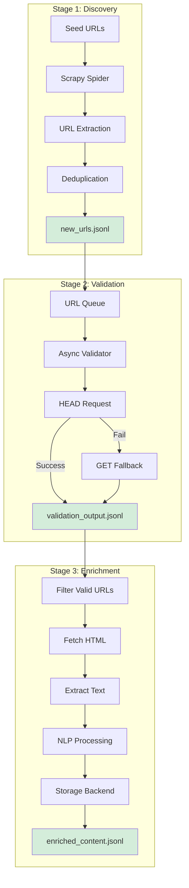

<div align="center">
  
  <h1>UConn Web Scraping Pipeline</h1>
  <p><strong>Discover.</strong> <strong>Validate.</strong> <strong>Enrich.</strong><br/>An asyncio-driven data platform purpose-built for the University of Connecticut digital ecosystem.</p>

  [](https://github.com/actions) 
  [](https://codecov.io)
  [](https://github.com/releases)

</div>

---

## Table of Contents
- [Getting Started](#getting-started)
- [System Architecture](#system-architecture)
- [Current Status](#current-status)
- [Development](#development)
- [Configuration Quick Reference](#configuration-quick-reference)
- [Stage Deep Dive](#stage-deep-dive)
- [Output Schema](#output-schema)
- [Quality, Observability, and Resilience](#quality-observability-and-resilience)
- [Contribution Guide](#contribution-guide)
- [Roadmap Highlights](#roadmap-highlights)
- [Detailed Documentation](#detailed-documentation)

---

## Getting Started

### Prerequisites
- **Python 3.11+** (tested on 3.11 and 3.12)
- **4GB RAM minimum** (8GB recommended for full crawls)
- **Operating System**: Windows 10+, Ubuntu 20.04+, macOS 11+

### Quick Installation

```bash
# Clone repository
git clone <repo-url>
cd Scrapy

# Run the scraper (handles all installation automatically)
./run_the_scrape
```

That's it. Everything else is automatic.

### Your First Crawl

```bash
# Single command - installs everything and runs pipeline
./run_the_scrape

# Or run specific stages
./run_the_scrape --stage 1  # Discovery only
./run_the_scrape --stage 2  # Validation only
./run_the_scrape --stage 3  # Enrichment only
```

**Output files**:
- Stage 1: `Scraping_project/data/processed/stage01/discovery_output.jsonl`
- Stage 2: `Scraping_project/data/processed/stage02/validation_output.jsonl`
- Stage 3: `Scraping_project/data/processed/stage03/enriched_content.jsonl`

## System Architecture

### High-Level Data Flow



### Component Overview

| Component | Technology | Purpose |
|-----------|-----------|---------|
| **Discovery Engine** | Scrapy + Twisted | Breadth-first web crawling |
| **URL Validator** | aiohttp + asyncio | Concurrent HTTP validation |
| **Content Processor** | lxml + XPath | HTML parsing and text extraction |
| **NLP Engine** | DeBERTa v3 (transformers) | Entity recognition, zero-shot classification |
| **Deduplication** | SQLite (URLDeduplicator) | Persistent URL tracking at scale |
| **Storage Layer** | JSONL / SQLite / Parquet / S3 | Pluggable data persistence |
| **Logging** | Structured JSON events | Machine-readable observability |
| **Configuration** | YAML + environment variables | Multi-environment support |

---

## Current Status

### Pipeline State (January 2025)
- **Stage 1 (Discovery)**: ✅ Fully operational
  - 25,583 URLs discovered
  - Sitemap/robots.txt bootstrap working
  - Dynamic URL discovery from data attributes, inline JSON, forms
  - Pagination URL generation implemented

- **Stage 2 (Validation)**: ✅ Fully operational
  - 22,521 URLs validated (87.9% of discovered URLs)
  - HEAD->GET fallback working
  - Connection pooling and retry logic functional
  - Recent fixes: user_agent config, connector limits, response handling

- **Stage 3 (Enrichment)**: ⚠️ Partially operational
  - 54 URLs enriched (0.2% of validated URLs)
  - NLP extraction working (spaCy)
  - Output files: enriched_content.jsonl, enriched_data.jsonl
  - Note: Low enrichment count may indicate incomplete run or configuration issue

### Windows Compatibility
✅ **Windows Support**: Pipeline runs on Windows with proper platform handling
- Fixed user_agent configuration bug
- Platform-specific connector limits
- Non-text response processing
- Proactor event loop for high concurrency

### Key Features

- ✅ **Scalable deduplication**: SQLite-backed URL tracking (handles millions of URLs)
- ✅ **DeBERTa NLP**: State-of-the-art transformer models for entity extraction
- ✅ **Structured logging**: Event-based JSON logs with trace correlation
- ✅ **Checkpoint resumability**: Automatically resume after interruptions
- ✅ **Multi-platform**: Windows, Linux, macOS support
- ✅ **Pluggable storage**: JSONL, SQLite, Parquet, S3 backends

---

## Development

### Running the Pipeline

```bash
cd Scraping_project

# Full pipeline (recommended)
python -m src.orchestrator.main --env development --stage all

# Individual stages
python -m src.orchestrator.main --env development --stage 1  # Discovery
python -m src.orchestrator.main --env development --stage 2  # Validation
python -m src.orchestrator.main --env development --stage 3  # Enrichment
```

### Updating Seed URLs

After running the validation stage (Stage 2), you can update the seed URL file (`uconn_urls.csv`) with high-quality URLs found during the crawl. This helps to expand the scope of future crawls.

To update the seed URLs, run the following command from the `Scraping_project/tools` directory:

```bash
python update_seeds.py
```

For more information, see the `README.md` file in the `tools` directory.

### Testing

```bash
python -m pytest                     # full test suite
python -m pytest tests/stage2 -k networking  # targeted validator regression tests
python -m pytest --maxfail=1 -q      # quick smoke
```

Coverage highlights:
- **Networking regressions:** `tests/stage2/test_validator_networking_regression.py` faithfully simulates aiohttp behavior through tailored mock sessions.
- **Orchestrator integration:** `tests/integration/test_orchestrator_e2e.py` validates multi-stage execution and checkpoint hand-offs.
- **Schema validation:** `tests/common/test_schemas*.py` guarantees JSONL contracts.

---

## Output Schema

### Final Enriched Output Example

The pipeline produces structured JSONL records with comprehensive metadata. Here's a real example from the UConn Health homepage:

```json
{
  "url": "https://health.uconn.edu/",
  "url_hash": "8cfc602a091fe1ec61f9e56d9fb2a49be7c60cf4e9c27aadf8b717b4a4e59575",
  "title": "Home | UConn Health",
  "text_content": "Skip Navigation Give Search UConn Health A-Z Patient Care...",
  "word_count": 259,
  "entities": [
    "UConn Health",
    "Patient Care, Research & Academics",
    "Connecticut",
    "John Dempsey Hospital",
    "2025"
  ],
  "keywords": [
    "uconn", "health", "patient", "care", "research",
    "connecticut", "academics", "medical", "excellence"
  ],
  "content_tags": [],
  "has_pdf_links": false,
  "has_audio_links": false,
  "status_code": 200,
  "content_type": "text/html",
  "enriched_at": "2025-09-30T14:05:39.082064",
  "processed_at": "2025-09-30T14:05:39.082270"
}
```

### Schema Field Reference

| Field | Type | Description | Source Stage |
|-------|------|-------------|--------------|
| `url` | string | Canonical page URL | Stage 1 |
| `url_hash` | string | SHA-256 hash (deduplication) | Stage 3 |
| `title` | string | HTML `<title>` content | Stage 3 |
| `text_content` | string | Clean body text | Stage 3 |
| `word_count` | integer | Word count | Stage 3 |
| `entities` | array[string] | Named entities (spaCy NER) | Stage 3 |
| `keywords` | array[string] | Top 15 keywords (TF-IDF) | Stage 3 |
| `content_tags` | array[string] | Future: taxonomy categories | Stage 3 |
| `has_pdf_links` | boolean | Contains PDF links | Stage 3 |
| `has_audio_links` | boolean | Contains media | Stage 3 |
| `status_code` | integer | HTTP status code | Stage 2 |
| `content_type` | string | MIME type | Stage 2 |
| `enriched_at` | string | NLP processing timestamp | Stage 3 |
| `processed_at` | string | Storage write timestamp | Stage 3 |

📖 **See [docs/project_internals.md](docs/project_internals.md#output-schema-and-data-structure) for complete schema documentation**

---

## Stage Deep Dive

### Stage 1: Discovery (`src/stage1`) 
- Breadth-first crawl seeded from `data/raw/uconn_urls.csv`.
- Dynamic heuristics inspect data attributes, inline JSON, and script tags to reveal AJAX endpoints.
- Deduplication and canonicalisation push clean records to `data/processed/stage01/new_urls.jsonl`.

### Stage 2: Validation (`src/stage2`) 
- `URLValidator` batches URLs, honours HEAD responses when sufficient, and executes GET fallbacks with shared TCP connectors.
- Content-Length governance: honors well-formed headers and falls back to the actual payload size when they are not, keeping downstream metrics consistent.
- Exception handling preserves original `aiohttp` error classes, yielding user-readable diagnostics while avoiding bare strings.
- Writes validation artefacts to `data/processed/stage02/validation_output.jsonl` with latency, status code, caching hints, and staleness scores.

### Stage 3: Enrichment (`src/stage3`) 
- Pulls only validated URLs (status 2xx/3xx) and extracts structured content: titles, body text, keyword hints, and media flags.
- Supports JSONL, SQLite, Parquet, or S3 outputs through the `enrichment.storage` configuration block.
- Emits adaptive feedback so discovery depth can be tuned based on observed content quality.

---

## Quick Actions
<table>
  <tr>
    <td style="background:#f4fbf9;border:1px solid #c9e8da;padding:16px;vertical-align:top;">
      <strong>Get started</strong><br/>
      <code>python -m venv .venv</code><br/>
      <code>pip install -r requirements.txt</code>
    </td>
    <td style="background:#f4f7fb;border:1px solid #c9d7f0;padding:16px;vertical-align:top;">
      <strong>Run a smoke</strong><br/>
      <code>python -m pytest --maxfail=1 -q</code><br/>
      <code>python main.py --env development --stage 1</code>
    </td>
    <td style="background:#fef7f1;border:1px solid #f5c97a;padding:16px;vertical-align:top;">
      <strong>Open observability</strong><br/>
      Inspect <code>data/checkpoints/</code><br/>
      Tail <code>logs/stage2.log</code> for live telemetry
    </td>
  </tr>
</table>

---

## Configuration Quick Reference

| Key | Description |
|-----|-------------|
| `SCRAPY_CONCURRENT_REQUESTS` | Overrides Scrapy concurrency (stage 1). |
| `STAGE1_MAX_DEPTH` | Caps traversal depth for discovery. |
| `stage2.max_workers` | Controls validator parallelism; automatically doubles for TCP connector limits. |
| `stage2.timeout` | Total request timeout fed into `aiohttp.ClientTimeout`. |
| `stage3.storage.backend` | Output target (`jsonl`, `sqlite`, `parquet`, `s3`). |
| `stage3.storage.rotation.max_items` | Chunk size before starting a new artefact. |

> Merge order: environment YAML -> environment variables -> CLI overrides.

---

## Quality, Observability, and Resilience

- **Checkpointing:** `src/common/checkpoints.py` persists progress per stage – restart-friendly and resumable mid-batch.
- **Adaptive depth and feedback:** Stage 2 results feed adaptive depth logic so Stage 1 prioritises high-value paths.
- **Structured metadata:** Validation results capture cache headers, staleness, redirects, and response timing using `time.perf_counter` for precision.
- **Content governance:** Schema validation via `src/common/schemas_validated.py` guarantees consumers receive predictable, contract-first payloads.
- **Monitoring hooks:** Prometheus exporter and enrichment storage emit metrics-friendly artefacts when enabled.

---

## Contribution Guide

1. Fork and branch from `main` (`git checkout -b feature/your-feature`).
2. Keep pull requests focused; update docs/tests alongside code.
3. Run pytest (and linting if configured) to verify a warning-free green build before opening a PR.
4. Document configuration toggles or migration notes in `docs/` when relevant.
5. Submit a PR with context: goal, testing evidence, follow-up actions.
- **Branch naming suggestions:** `feature/*`, `fix/*`, `docs/*`, `refactor/*`, `test/*`.

---

## Roadmap Highlights

### Planned Features

- [ ] **Monitoring dashboard**: Real-time visualization (FastAPI + WebSockets)
- [ ] **Docker deployment**: Containerized setup with docker-compose
- [ ] **API layer**: REST API for querying enriched content
- [ ] **Rate limiting**: Token bucket for respectful crawling

### Recent Updates (2025-01-03)

- ✅ **DeBERTa v3 NLP**: Replaced spaCy with microsoft/deberta-v3-base
- ✅ **SQLite deduplication**: Database-backed URL tracking replaces in-memory sets
- ✅ **Fixed orchestrator bug**: Stage 3 URL deduplication now working correctly
- ✅ **Structured logging**: Event-based logging with centralized LogEvent enum
- ✅ **Code cleanup**: Removed unnecessary comments, consolidated docs


---

## Detailed Documentation

| Document | Description |
|----------|-------------|
| [docs/project_internals.md](docs/project_internals.md) | Technical deep-dive: Stage 3 workflow, schema details, checkpoints, storage backends, platform compatibility |
| [SPRINT_BACKLOG.md](SPRINT_BACKLOG.md) | Sprint planning and feature backlog |
| [tools/README.md](tools/README.md) | Utility scripts for testing, validation, and maintenance |
| [config/development.yml](config/development.yml) | Development environment configuration |
| [config/production.yml](config/production.yml) | Production environment configuration |

---

## Troubleshooting

### Common Issues

**Q: Stage 3 fails with `ModuleNotFoundError`**
```bash
# Workaround: Run Stage 3 directly via Scrapy
cd src/stage3
scrapy crawl enrichment
```

**Q: spaCy model not found error**
```bash
# Download the required model
python -m spacy download en_core_web_sm
```

**Q: Out of memory errors during large crawls**
```bash
# Enable storage rotation in config/development.yml
stages:
  enrichment:
    storage:
      rotation:
        max_items: 1000
```

📖 **See [docs/project_internals.md](docs/project_internals.md#troubleshooting) for comprehensive troubleshooting guide**

---

**Questions or feedback?** Open an issue or see the detailed documentation links above.

Happy scraping! 🔍
