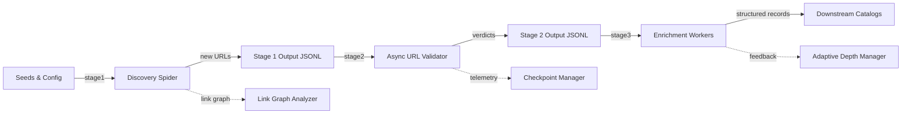

<div align="center">
  
  <h1>UConn Web Scraping Pipeline</h1>
  <p><strong>Discover.</strong> <strong>Validate.</strong> <strong>Enrich.</strong><br/>An asyncio-driven data platform purpose-built for the University of Connecticut digital ecosystem.</p>
  <p>
    
    
    
  </p>
  <p>
    
    
  </p>
</div>

---

## Table of Contents
- [Why This Pipeline](#why-this-pipeline)
- [Current Status](#current-status)
- [System Architecture](#system-architecture)
- [Repository Walkthrough](#repository-walkthrough)
- [Stage Deep Dive](#stage-deep-dive)
- [Quick Actions](#quick-actions)
- [Configuration Quick Reference](#configuration-quick-reference)
- [Operating the Pipeline](#operating-the-pipeline)
- [Quality, Observability, and Resilience](#quality-observability-and-resilience)
- [Testing Strategy](#testing-strategy)
- [Contribution Guide](#contribution-guide)
- [Roadmap Highlights](#roadmap-highlights)
- [Design Language and Visual Identity](#design-language-and-visual-identity)

---

## Why This Pipeline

A production-ready web scraping system designed for the University of Connecticut domain.

**Key Features:**
- **Discovery**: Breadth-first crawling with dynamic URL extraction from data attributes, inline JSON, and forms
- **Validation**: Concurrent URL validation with HEAD->GET fallback, connection pooling, and retry logic
- **Enrichment**: NLP-powered content extraction using spaCy with schema-validated JSONL output
- **Resilience**: Checkpoint-based resumption, backpressure handling, and graceful error recovery
- **Cross-Platform**: Linux, macOS, and Windows support with platform-specific optimizations

## Current Status

### Pipeline State (October 2025)
- **Stage 1 (Discovery)**: ✅ Fully operational
  - 25,583 URLs discovered
  - Sitemap/robots.txt bootstrap working
  - Dynamic URL discovery from data attributes, inline JSON, forms
  - Pagination URL generation implemented

- **Stage 2 (Validation)**: ✅ Fully operational
  - 22,521 URLs validated (87.9% of discovered URLs)
  - HEAD->GET fallback working
  - Connection pooling and retry logic functional
  - Recent fixes: user_agent config, connector limits, response handling

- **Stage 3 (Enrichment)**: ⚠️ Partially operational
  - 54 URLs enriched (0.2% of validated URLs)
  - NLP extraction working (spaCy)
  - Output files: enriched_content.jsonl, enriched_data.jsonl
  - Note: Low enrichment count may indicate incomplete run or configuration issue

### Windows Compatibility
✅ **Windows Support**: Pipeline runs on Windows with proper platform handling
- Fixed user_agent configuration bug
- Platform-specific connector limits
- Non-text response processing
- Proactor event loop for high concurrency

### CI/CD Pipeline

? **GitHub Actions Flow**: Every push runs linting, pytest suites, and staged packaging to keep discovery -> validation -> enrichment deployments healthy.
- Workflow file: `.github/workflows/ci.yml`
- Steps: dependency install, static analysis, unit/integration tests, artefact packaging
- Outputs: coverage summary, validation reports, optional deployment hooks

---

## System Architecture


**Orchestration core:** `src/orchestrator/main.py` stitches each stage together with async queues, checkpoint resumption, and environment-aware configuration.

---

## Repository Walkthrough

| Path | Description |
|------|-------------|
| `main.py` | CLI front door that resolves configuration, selects stages, and invokes the orchestrator. |
| `config/` | Environment profiles (`development.yml`, `production.yml`) plus overrides via environment variables. |
| `data/` | Seeds, checkpoint snapshots, processed outputs, and diagnostics. |
| `docs/` | Design notes, validation matrices, and operational runbooks. |
| `src/common/` | Shared utilities (schemas, checkpoints, adaptive depth, link graph analysis, metrics exporters). |
| `src/stage1/` | Discovery spiders, prioritisation heuristics, and persistence pipeline. |
| `src/stage2/` | Async validator featuring HEAD->GET fallback, precise content-length handling, and descriptive error capture. |
| `src/stage3/` | Enrichment workflow with text extraction, entity tagging, and pluggable storage backends. |
| `tests/` | Pytest suites covering unit, integration, networking regression, and orchestrator flows. |

---

## Stage Deep Dive

### Stage 1: Discovery (`src/stage1`) 
- Breadth-first crawl seeded from `data/raw/uconn_urls.csv`.
- Dynamic heuristics inspect data attributes, inline JSON, and script tags to reveal AJAX endpoints.
- Deduplication and canonicalisation push clean records to `data/processed/stage01/new_urls.jsonl`.

### Stage 2: Validation (`src/stage2`) 
- `URLValidator` batches URLs, honours HEAD responses when sufficient, and executes GET fallbacks with shared TCP connectors.
- Content-Length governance: honors well-formed headers and falls back to the actual payload size when they are not, keeping downstream metrics consistent.
- Exception handling preserves original `aiohttp` error classes, yielding user-readable diagnostics while avoiding bare strings.
- Writes validation artefacts to `data/processed/stage02/validation_output.jsonl` with latency, status code, caching hints, and staleness scores.

### Stage 3: Enrichment (`src/stage3`) 
- Pulls only validated URLs (status 2xx/3xx) and extracts structured content: titles, body text, keyword hints, and media flags.
- Supports JSONL, SQLite, Parquet, or S3 outputs through the `enrichment.storage` configuration block.
- Emits adaptive feedback so discovery depth can be tuned based on observed content quality.

---

## Quick Actions
<table>
  <tr>
    <td style="background:#f4fbf9;border:1px solid #c9e8da;padding:16px;vertical-align:top;">
      <strong>Get started</strong><br/>
      <code>python -m venv .venv</code><br/>
      <code>pip install -r requirements.txt</code>
    </td>
    <td style="background:#f4f7fb;border:1px solid #c9d7f0;padding:16px;vertical-align:top;">
      <strong>Run a smoke</strong><br/>
      <code>python -m pytest --maxfail=1 -q</code><br/>
      <code>python main.py --env development --stage 1</code>
    </td>
    <td style="background:#fef7f1;border:1px solid #f5c97a;padding:16px;vertical-align:top;">
      <strong>Open observability</strong><br/>
      Inspect <code>data/checkpoints/</code><br/>
      Tail <code>logs/stage2.log</code> for live telemetry
    </td>
  </tr>
</table>

---

## Configuration Quick Reference

| Key | Description |
|-----|-------------|
| `SCRAPY_CONCURRENT_REQUESTS` | Overrides Scrapy concurrency (stage 1). |
| `STAGE1_MAX_DEPTH` | Caps traversal depth for discovery. |
| `stage2.max_workers` | Controls validator parallelism; automatically doubles for TCP connector limits. |
| `stage2.timeout` | Total request timeout fed into `aiohttp.ClientTimeout`. |
| `stage3.storage.backend` | Output target (`jsonl`, `sqlite`, `parquet`, `s3`). |
| `stage3.storage.rotation.max_items` | Chunk size before starting a new artefact. |

> Merge order: environment YAML -> environment variables -> CLI overrides.

---

## Operating the Pipeline

```bash
# Activate your virtual environment, then:
python -m venv .venv
source .venv/bin/activate  # or .venv\Scripts\activate on Windows

# 1. Seed discovery only
python main.py --env development --stage 1

# 2. Validate previously discovered URLs
python main.py --env development --stage 2

# 3. Enrich validated pages
python main.py --env development --stage 3

# 4. Full sequential run
python main.py --env development --stage all

# 5. Inspect resolved configuration without execution
python main.py --env development --config-only
```

**Bootstrap checklist**
1. `pip install -r requirements.txt`
2. `python -m spacy download en_core_web_sm` (for enrichment NLP helpers)
3. Populate `data/raw/uconn_urls.csv` with seeds (no header)
4. Monitor console output (or log files) for checkpoint progress and status summaries

---

## Quality, Observability, and Resilience

- **Checkpointing:** `src/common/checkpoints.py` persists progress per stage – restart-friendly and resumable mid-batch.
- **Adaptive depth and feedback:** Stage 2 results feed adaptive depth logic so Stage 1 prioritises high-value paths.
- **Structured metadata:** Validation results capture cache headers, staleness, redirects, and response timing using `time.perf_counter` for precision.
- **Content governance:** Schema validation via `src/common/schemas_validated.py` guarantees consumers receive predictable, contract-first payloads.
- **Monitoring hooks:** Prometheus exporter and enrichment storage emit metrics-friendly artefacts when enabled.

---

## Testing Strategy

```bash
python -m pytest                     # full test suite
python -m pytest tests/stage2 -k networking  # targeted validator regression tests
python -m pytest --maxfail=1 -q      # quick smoke
```

Coverage highlights:
- **Networking regressions:** `tests/stage2/test_validator_networking_regression.py` faithfully simulates aiohttp behavior through tailored mock sessions.
- **Orchestrator integration:** `tests/integration/test_orchestrator_e2e.py` validates multi-stage execution and checkpoint hand-offs.
- **Schema validation:** `tests/common/test_schemas*.py` guarantees JSONL contracts.

---

## Contribution Guide

1. Fork and branch from `main` (`git checkout -b feature/your-feature`).
2. Keep pull requests focused; update docs/tests alongside code.
3. Run pytest (and linting if configured) to verify a warning-free green build before opening a PR.
4. Document configuration toggles or migration notes in `docs/` when relevant.
5. Submit a PR with context: goal, testing evidence, follow-up actions.
- **Branch naming suggestions:** `feature/*`, `fix/*`, `docs/*`, `refactor/*`, `test/*`.

---

## Roadmap Highlights
- Dynamic selector hardening through heuristic scoring and smoke checks.
- Rendering diagnostics with optional DOM snapshots for JavaScript-heavy endpoints.
- Extended schema catalogues published under `data/catalog/` for downstream discoverability.
- Operational dashboards for checkpoint success/failure, throughput, and retry rates.

---

## Design Language and Visual Identity
> A consistent design vocabulary keeps code, documentation, and UX aligned.

- **Color palette:** Navy (#05437C) plus Huskies blue (#2E6F95) with neutral accents for readability and UConn resonance.
- **Typography:** Prefer semantic Markdown headings, short paragraphs, and tables to optimise scan-ability on GitHub.
- **Iconography:** Shields.io badges highlight runtime guarantees (Python version, test posture) without overwhelming the reader.
- **Layout rhythm:** Section dividers (`---`) and callouts maintain visual pacing, guiding readers from overview to operations to contribution.

---

Happy scraping — see you in the next commit!
