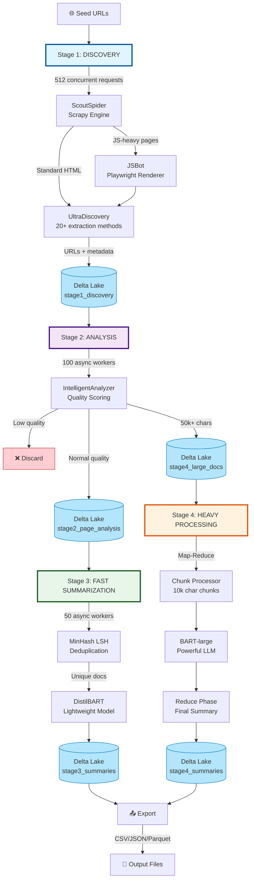
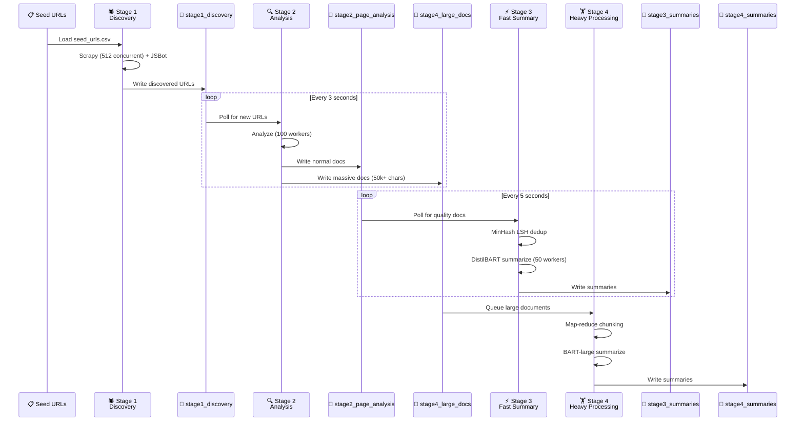
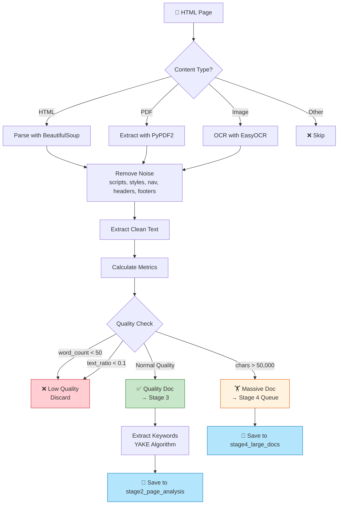

# 🚀 UConn Web Scraping Pipeline

<div align="center">

**High-Performance Multi-Stage Web Intelligence System**

[](https://www.python.org/downloads/)
[](https://scrapy.org/)
[](https://delta.io/)
[](LICENSE)

[Quick Start](#-quick-start) • [Architecture](#-architecture) • [Configuration](#%EF%B8%8F-configuration) • [Data Access](#-data-access)

</div>

---

## 📊 Interactive Pipeline Overview


```mermaid
graph TB
    START[🌐 Seed URLs] --> S1[Stage 1: DISCOVERY]

    S1 --> |512 concurrent requests| SCRAPY[ScoutSpider<br/>Scrapy Engine]
    SCRAPY --> |JS-heavy pages| JSBOT[JSBot<br/>Playwright Renderer]
    SCRAPY --> |Standard HTML| ULTRA[UltraDiscovery<br/>20+ extraction methods]
    JSBOT --> ULTRA

    ULTRA --> |URLs + metadata| DL1[(Delta Lake<br/>stage1_discovery)]

    DL1 --> S2[Stage 2: ANALYSIS]
    S2 --> |100 async workers| INTEL[IntelligentAnalyzer<br/>Quality Scoring]

    INTEL --> |Low quality| SKIP[❌ Discard]
    INTEL --> |Normal quality| DL2[(Delta Lake<br/>stage2_page_analysis)]
    INTEL --> |50k+ chars| DL4[(Delta Lake<br/>stage4_large_docs)]

    DL2 --> S3[Stage 3: FAST SUMMARIZATION]
    S3 --> |50 async workers| MINHASH[MinHash LSH<br/>Deduplication]
    MINHASH --> |Unique docs| DISTIL[DistilBART<br/>Lightweight Model]
    DISTIL --> DL3[(Delta Lake<br/>stage3_summaries)]

    DL4 --> S4[Stage 4: HEAVY PROCESSING]
    S4 --> |Map-Reduce| CHUNK[Chunk Processor<br/>10k char chunks]
    CHUNK --> BART[BART-large<br/>Powerful LLM]
    BART --> REDUCE[Reduce Phase<br/>Final Summary]
    REDUCE --> DL5[(Delta Lake<br/>stage4_summaries)]

    DL3 --> EXPORT[📤 Export]
    DL5 --> EXPORT
    EXPORT --> |CSV/JSON/Parquet| OUTPUT[📁 Output Files]

    style S1 fill:#e1f5fe,stroke:#01579b,stroke-width:3px
    style S2 fill:#f3e5f5,stroke:#4a148c,stroke-width:3px
    style S3 fill:#e8f5e9,stroke:#1b5e20,stroke-width:3px
    style S4 fill:#fff3e0,stroke:#e65100,stroke-width:3px
    style DL1 fill:#b3e5fc,stroke:#0277bd
    style DL2 fill:#b3e5fc,stroke:#0277bd
    style DL3 fill:#b3e5fc,stroke:#0277bd
    style DL4 fill:#b3e5fc,stroke:#0277bd
    style DL5 fill:#b3e5fc,stroke:#0277bd
    style SKIP fill:#ffcdd2,stroke:#c62828
```

## 🎯 Pipeline Performance Metrics

| Stage | Concurrency | Throughput | Processing Model |
|-------|------------|------------|------------------|
| **Stage 1: Discovery** | 512 concurrent requests | ~200 URLs/sec | Scrapy + Playwright |
| **Stage 2: Analysis** | 100 async workers | ~50 pages/sec | Async HTTP + BeautifulSoup |
| **Stage 3: Summarization** | 50 async workers | ~20 summaries/sec | DistilBART (350 MB) |
| **Stage 4: Large Docs** | 1 worker (CPU-bound) | ~2 docs/min | BART-large (1.6 GB) |

## ✨ Key Features

### 🔍 **Stage 1: Ultra-Aggressive Discovery**
- **ScoutSpider**: 512 concurrent Scrapy requests with intelligent routing
- **JSBot**: Playwright-based renderer for JavaScript-heavy pages
- **UltraDiscovery**: 20+ extraction methods including:
  - Standard HTML tags (`<a>`, ``, `<script>`, `<link>`)
  - Inline scripts and event handlers (`onclick`, `fetch()`, `axios`)
  - CSS (`url()`, `@import`)
  - Encoded URLs (Base64, URI encoding)
  - JSON-LD structured data
  - Microdata, srcset, meta tags
  - Query parameters and pagination patterns

### 🧠 **Stage 2: Intelligent Quality Control**
- **Quality Scoring**: Multi-factor algorithm (word count + text-to-HTML ratio)
- **Content Extraction**: HTML, PDF (PyPDF2), Images (EasyOCR)
- **Noise Removal**: Strips `<script>`, `<style>`, `<nav>`, `<header>`, `<footer>`
- **Smart Triage**: Routes massive documents (50k+ chars) to Stage 4
- **Keyword Extraction**: YAKE algorithm for automated tagging

### ⚡ **Stage 3: High-Speed Summarization**
- **MinHash LSH**: Locality-sensitive hashing for near-duplicate detection (datasketch)
- **DistilBART**: Lightweight 350 MB model for fast summarization
- **Async Workers**: 50 concurrent tasks for maximum throughput
- **Similarity Threshold**: Configurable deduplication (default: 0.3)

### 🏋️ **Stage 4: Heavy Document Processing**
- **Map-Reduce Architecture**: Chunks large documents into 10k character segments
- **BART-large**: Powerful 1.6 GB CNN model for high-quality summaries
- **Reduce Phase**: Combines chunk summaries into final coherent summary
- **Queue-Based**: Only processes documents flagged as "massive" by Stage 2

### 💾 **Delta Lake Storage**
- **ACID Transactions**: Guaranteed data consistency
- **Checkpointing**: Automatic state persistence (every 100 writes)
- **Time Travel**: Version history for all tables
- **Columnar Storage**: Efficient Parquet format
- **Force Shutdown**: 15-second timeout prevents hanging (no more frustration!)

---

## 🚀 Quick Start

### 📦 Installation

```bash
# Clone repository
git clone https://github.com/benjaminrussell/uconn-scraper.git
cd uconn-scraper

# Create virtual environment
python -m venv .venv
source .venv/bin/activate  # Windows: .venv\Scripts\activate

# Install ALL dependencies (single source of truth)
pip install -e .

# Install Playwright browsers for JS rendering
playwright install chromium

# Validate setup
python run_pipeline.py validate

# Download transformer models (REQUIRED - ~2 GB total)
python run_pipeline.py setup
```

> **⚠️ Model Download Required**: Models are downloaded via the unified CLI. DistilBART (350 MB) and BART-large (1.6 GB) are cached in `~/.cache/huggingface/hub/`.

### 🎮 Unified CLI Commands

The pipeline now uses a **single entry point** for all operations:

```bash
# Run the pipeline (default: concurrent mode)
python run_pipeline.py run

# Download models
python run_pipeline.py setup

# Validate installation
python run_pipeline.py validate

# Check health & statistics
python run_pipeline.py health

# Export data
python run_pipeline.py export --list               # List tables
python run_pipeline.py export --all                # Export all tables
python run_pipeline.py export --table stage3_summaries --format csv

# Clean Delta Lake
python run_pipeline.py clean

# Reset pipeline
python run_pipeline.py reset
```

### 🏃 Running the Pipeline

#### **Concurrent Mode (Recommended)**

```bash
python run_pipeline.py run
# OR just:
python run_pipeline.py
```

All stages run in parallel:
- Stage 1 discovers URLs continuously
- Stage 2 polls for new URLs every 3 seconds
- Stage 3 polls for quality docs every 5 seconds
- Maximum throughput and efficiency

#### **Sequential Mode**

```bash
python run_pipeline.py run --sequential
```

Runs stages in order: Stage 1 → Stage 2 → Stage 3 → Stage 4

#### **Custom Worker Counts**

```bash
python run_pipeline.py run --stage2-workers 150 --stage3-workers 75
```

#### **Skip Stages**

```bash
python run_pipeline.py run --skip-stage1  # Skip discovery
python run_pipeline.py run --skip-stage2  # Skip analysis
python run_pipeline.py run --skip-stage3  # Skip summarization
```

### 🔍 Health Check & Statistics

```bash
python run_pipeline.py health
```

**Example Output:**
```
🏥 PIPELINE HEALTH CHECK
━━━━━━━━━━━━━━━━━━━━━━━━━━━━━━━━━━━━━━━━━━━━━━━━━━━━━━━━━

📊 DELTA LAKE STATISTICS:
  ✅ stage1_discovery: 15,234 records
  ✅ stage2_page_analysis: 8,456 records
  ✅ stage3_summaries: 3,891 records
  ✅ stage4_summaries: 127 records

⚙️  SYSTEM STATUS:
  ✅ Delta Lake: Operational
  ✅ Models: Downloaded
```

---

## 🏗️ Architecture Deep Dive

### 📁 Project Structure

```
Scraping_project/
│
├── 🎯 Core Pipeline
│   ├── run_pipeline.py              # Main orchestrator (concurrent/sequential modes)
│   ├── setup_models.py              # Download transformer models
│   ├── health_check.py              # System diagnostics
│   ├── export_table.py              # Export Delta tables to CSV/JSON/Parquet
│   └── pyproject.toml              # Dependencies (single source of truth)
│
├── 📊 Data
│   ├── delta_lake/                 # Delta Lake storage (auto-created)
│   │   ├── stage1_discovery/       # Discovered URLs
│   │   ├── stage1_errors/          # Crawl errors
│   │   ├── stage2_page_analysis/   # Analyzed pages
│   │   ├── stage3_summaries/       # Fast summaries
│   │   └── stage4_summaries/       # Large doc summaries
│   ├── seed_urls.csv               # Seed URLs (UConn domains)
│   ├── logs/                       # Pipeline logs
│   └── cache/                      # Temporary cache
│
├── 🔧 Source Code
│   ├── common/                     # Shared utilities
│   │   ├── delta_lake.py           # Delta Lake manager (ACID, checkpointing)
│   │   └── constants.py            # Global configuration
│   │
│   ├── stage1/                     # Discovery Stage
│   │   ├── scout_spider.py         # Main Scrapy spider (512 concurrent)
│   │   ├── js_bot.py              # Playwright JS renderer
│   │   └── ultra_discovery.py      # 20+ URL extraction methods
│   │
│   ├── stage2/                     # Analysis Stage
│   │   ├── stage2_worker.py        # Async worker (100 concurrent)
│   │   └── intelligent_analyzer.py # Quality scoring & extraction
│   │
│   ├── stage3/                     # Summarization Stage
│   │   └── stage3_worker.py        # Async worker with MinHash LSH
│   │
│   └── stage4/                     # Heavy Processing Stage
│       ├── large_doc_processor.py  # Map-reduce processor
│       └── summarization.py        # BART-large utilities
│
├── 🧪 Testing
│   ├── tests/                      # pytest test suite
│   │   ├── test_pipeline.py
│   │   ├── test_stage2_worker.py
│   │   └── test_intelligent_analyzer.py
│   └── temp_testing/               # Integration tests
│       └── test_pipeline_stages.py
│
└── 🔄 CI/CD
    └── .github/workflows/
        └── main.yml                # Automated testing & deployment
```

### 🔄 Data Flow Diagram


```mermaid
sequenceDiagram
    participant Seeds as 📋 Seed URLs
    participant S1 as 🕷️ Stage 1<br/>Discovery
    participant DL1 as 💾 stage1_discovery
    participant S2 as 🔍 Stage 2<br/>Analysis
    participant DL2 as 💾 stage2_page_analysis
    participant DL4 as 💾 stage4_large_docs
    participant S3 as ⚡ Stage 3<br/>Fast Summary
    participant S4 as 🏋️ Stage 4<br/>Heavy Processing
    participant DL3 as 💾 stage3_summaries
    participant DL5 as 💾 stage4_summaries

    Seeds->>S1: Load seed_urls.csv
    S1->>S1: Scrapy (512 concurrent) + JSBot
    S1->>DL1: Write discovered URLs

    loop Every 3 seconds
        DL1->>S2: Poll for new URLs
        S2->>S2: Analyze (100 workers)
        S2->>DL2: Write normal docs
        S2->>DL4: Write massive docs (50k+ chars)
    end

    loop Every 5 seconds
        DL2->>S3: Poll for quality docs
        S3->>S3: MinHash LSH dedup
        S3->>S3: DistilBART summarize (50 workers)
        S3->>DL3: Write summaries
    end

    DL4->>S4: Queue large documents
    S4->>S4: Map-reduce chunking
    S4->>S4: BART-large summarize
    S4->>DL5: Write summaries
```

### 🎛️ Quality Control Flow


```mermaid
flowchart TD
    A[📄 HTML Page] --> B{Content Type?}
    B -->|HTML| C[Parse with BeautifulSoup]
    B -->|PDF| D[Extract with PyPDF2]
    B -->|Image| E[OCR with EasyOCR]
    B -->|Other| F[❌ Skip]

    C --> G[Remove Noise<br/>scripts, styles, nav, headers, footers]
    D --> G
    E --> G

    G --> H[Extract Clean Text]
    H --> I[Calculate Metrics]
    I --> J{Quality Check}

    J -->|word_count < 50| K[❌ Low Quality<br/>Discard]
    J -->|text_ratio < 0.1| K
    J -->|chars > 50,000| L[🏋️ Massive Doc<br/>→ Stage 4 Queue]
    J -->|Normal Quality| M[✅ Quality Doc<br/>→ Stage 3]

    M --> N[Extract Keywords<br/>YAKE Algorithm]
    N --> O[💾 Save to stage2_page_analysis]
    L --> P[💾 Save to stage4_large_docs]

    style K fill:#ffcdd2,stroke:#c62828
    style L fill:#fff3e0,stroke:#e65100
    style M fill:#c8e6c9,stroke:#2e7d32
    style O fill:#b3e5fc,stroke:#0277bd
    style P fill:#b3e5fc,stroke:#0277bd
```

---

## ⚙️ Configuration

### 🔧 Stage 1: Discovery Settings

Edit `src/stage1/scout_spider.py`:

```python
custom_settings = {
    'CONCURRENT_REQUESTS': 512,              # Parallel requests (2x boost!)
    'CONCURRENT_REQUESTS_PER_DOMAIN': 256,   # Per-domain limit (2x boost!)
    'DEPTH_LIMIT': 5,                        # Max crawl depth (0 = seeds only)
    'CLOSESPIDER_PAGECOUNT': 0,              # 0 = unlimited
    'DOWNLOAD_TIMEOUT': 30,                  # Request timeout (seconds)
    'REACTOR_THREADPOOL_MAXSIZE': 64,        # Thread pool size
    'MEMUSAGE_LIMIT_MB': 8192,               # 8 GB memory limit
}

# Extension filtering (20+ file types)
IGNORED_EXTENSIONS = [
    '.jpg', '.png', '.gif', '.pdf', '.mp4', '.zip', '.css', '.js'
    # ... (prevents crawling non-HTML content)
]
```

### 🧠 Stage 2: Quality Thresholds

Edit `src/stage2/intelligent_analyzer.py`:

```python
MIN_WORD_COUNT = 50                    # Minimum words for quality
MIN_TEXT_TO_HTML_RATIO = 0.1           # Minimum content ratio (10%)
MASSIVE_DOC_THRESHOLD = 50000          # Characters to trigger Stage 4
```

### ⚡ Stage 3: Summarization Settings

Edit `src/stage3/stage3_worker.py`:

```python
max_concurrent = 50                     # Concurrent workers (was 20)
batch_size = 100                        # Documents per batch (was 50)
SIMILARITY_THRESHOLD = 0.3              # MinHash LSH threshold (0.0-1.0)
                                        # Lower = more similar required
```

### 🏋️ Stage 4: Large Document Processing

Edit `src/stage4/large_doc_processor.py`:

```python
CHUNK_SIZE = 10000                      # Characters per chunk
CHUNK_OVERLAP = 500                     # Overlap between chunks
MAX_SUMMARY_LENGTH = 500                # Max summary length
```

### 🔄 Pipeline Orchestration

Edit `run_pipeline.py`:

```python
await orchestrate_pipeline(
    enable_scrapy=True,           # Run Scrapy crawler
    enable_js_bot=True,          # Run JS rendering bot
    enable_stage2=True,          # Run analysis workers
    enable_stage3=True,          # Run summarization workers
    stage2_workers=100,          # Stage 2 concurrency
    stage3_workers=50,           # Stage 3 concurrency
    continuous_mode=True         # Concurrent vs sequential
)
```

---

## 💾 Data Access

### 📖 Reading Delta Lake Tables

```python
from src.common.delta_lake import get_delta_manager

delta = get_delta_manager()

# Stage 1: Discovered URLs
urls = delta.read('stage1_discovery')
print(f"📊 Total URLs: {len(urls)}")

# Stage 2: Analyzed pages
pages = delta.read('stage2_page_analysis')
quality_pages = [p for p in pages if not p.get('is_low_quality')]
massive_docs = [p for p in pages if p.get('is_massive_doc')]
print(f"✅ Quality: {len(quality_pages)}, 🏋️ Massive: {len(massive_docs)}")

# Stage 3: Fast summaries
summaries = delta.read('stage3_summaries')
for summary in summaries[:5]:
    print(f"📝 {summary['url']}: {summary['summary'][:100]}...")

# Stage 4: Large document summaries
large_summaries = delta.read('stage4_summaries')
print(f"🏋️ Large doc summaries: {len(large_summaries)}")
```

### 📤 Exporting Data

**Using Unified CLI:**

```bash
# List all tables with statistics
python run_pipeline.py export --list

# Export single table to CSV
python run_pipeline.py export --table stage3_summaries --format csv

# Export single table to JSON
python run_pipeline.py export --table stage2_page_analysis --format json

# Export ALL tables to CSV (creates exports/ directory)
python run_pipeline.py export --all --format csv
```

**Using Python API:**

```python
from src.common.delta_lake import get_delta_manager

delta = get_delta_manager()

# Export single table
result = delta.export('stage3_summaries', 'exports/summaries.csv', format='csv')
print(f"Exported {result['rows']} rows, {result['size_mb']:.2f} MB")

# Export all tables
results = delta.export_all('exports', format='csv')
for r in results:
    if 'error' not in r:
        print(f"{r['table']}: {r['rows']} rows")
```

**Example Output:**
```
📊 DELTA LAKE TABLES:
━━━━━━━━━━━━━━━━━━━━━━━━━━━━━━━━━━━━━━━━━━━━━━━━━━━━━━━━━

✅ stage1_discovery: 15,234 rows, 3 files
✅ stage2_page_analysis: 8,456 rows, 12 files
✅ stage3_summaries: 3,891 rows, 8 files
✅ stage4_summaries: 127 rows, 2 files
```

### 🗄️ DuckDB SQL Queries

```python
import duckdb

# Connect to Delta Lake Parquet files
con = duckdb.connect()

# Query discovered URLs by domain
result = con.execute("""
    SELECT domain, COUNT(*) as url_count
    FROM read_parquet('data/delta_lake/stage1_discovery/*.parquet')
    GROUP BY domain
    ORDER BY url_count DESC
    LIMIT 10
""").fetchdf()

print(result)

# Find highest quality pages
result = con.execute("""
    SELECT url, quality_score, word_count
    FROM read_parquet('data/delta_lake/stage2_page_analysis/*.parquet')
    WHERE NOT is_low_quality
    ORDER BY quality_score DESC
    LIMIT 20
""").fetchdf()

print(result)
```

### ✨ Delta Lake Features

| Feature | Description |
|---------|-------------|
| **ACID Transactions** | Guaranteed data consistency across all operations |
| **Time Travel** | Query historical versions: `delta.read('table', version=5)` |
| **Checkpointing** | Auto-saves every 100 writes (configurable) |
| **Schema Enforcement** | Validates data types on write |
| **Columnar Storage** | Efficient Parquet format for analytics |
| **Force Shutdown** | 15-second timeout prevents hanging (issue fixed!) |

---

## 🧪 Testing

### 🔬 Test Suite

```bash
# Run all tests
pytest tests/ -v

# Run specific test suite
pytest tests/test_pipeline.py -v
pytest tests/test_stage2_worker.py -v

# Run with coverage
pytest tests/ --cov=src --cov-report=html
open htmlcov/index.html  # View coverage report

# Run integration tests
pytest temp_testing/test_pipeline_stages.py -v
```

### 🧹 Code Quality

```bash
# Linting
ruff check .

# Type checking
mypy src/ --ignore-missing-imports

# Security audit
pip-audit
```

### 🔄 CI/CD Pipeline

GitHub Actions workflow (`.github/workflows/main.yml`):

```yaml
✅ Linting (Ruff + mypy)
✅ Security (pip-audit)
✅ Testing (pytest with coverage)
✅ Build validation
✅ Deploy (on main branch)
```

---

## 🛠️ Pipeline Management

All pipeline management is now handled through the **unified CLI**:

### 🧹 Pipeline Reset

```bash
# Clean Delta Lake and reload seed URLs
python run_pipeline.py reset
```

**Prompts for confirmation:**
```
⚠️  WARNING: This will DELETE all Delta Lake data!
Type 'RESET' to confirm: RESET

✅ Delta Lake data deleted
✅ Empty Delta Lake directory created
```

**Skip confirmation (use with caution):**
```bash
python run_pipeline.py reset -y
```

### 🗑️ Clean Delta Lake

```bash
# Delete all Delta Lake tables
python run_pipeline.py clean

# Skip confirmation
python run_pipeline.py clean -y
```

### 📊 Data Export

```bash
# List available tables
python run_pipeline.py export --list

# Export single table
python run_pipeline.py export --table stage3_summaries --format csv

# Export all tables
python run_pipeline.py export --all --format csv
```

### ✅ Validation & Health

```bash
# Validate installation
python run_pipeline.py validate

# Check pipeline health
python run_pipeline.py health
```

### 🔧 Model Setup

```bash
# Download transformer models
python run_pipeline.py setup

# Skip confirmation
python run_pipeline.py setup -y
```

---

## 🚨 Troubleshooting

### Common Issues

<details>
<summary><strong>❌ ModuleNotFoundError: No module named 'datasketch'</strong></summary>

**Solution:**
```bash
pip install datasketch>=1.6.0
```

**Note:** datasketch is a **required** dependency for MinHash LSH deduplication in Stage 3. No fallbacks are used.
</details>

<details>
<summary><strong>❌ Delta Lake shutdown hangs / never finishes</strong></summary>

**Solution:** This has been **fixed** in the latest version!

The Delta Lake manager now has a `force_shutdown()` method with a 15-second timeout:

```python
delta.force_shutdown(timeout=15)  # Force quit after 15s
```

This prevents the frustrating infinite hanging on Ctrl+C.
</details>

<details>
<summary><strong>❌ Models not found during pipeline run</strong></summary>

**Solution:**
```bash
# Download models manually
python setup_models.py

# Or use transformers directly:
python -c "
from transformers import pipeline
pipeline('summarization', model='sshleifer/distilbart-cnn-12-6')
pipeline('summarization', model='facebook/bart-large-cnn')
"
```
</details>

<details>
<summary><strong>❌ Playwright browser not found</strong></summary>

**Solution:**
```bash
playwright install chromium
```
</details>

<details>
<summary><strong>❌ Memory issues with large documents</strong></summary>

**Solution:** Reduce concurrency in `run_pipeline.py`:

```python
await orchestrate_pipeline(
    stage2_workers=50,   # Reduce from 100
    stage3_workers=20,   # Reduce from 50
)
```
</details>

<details>
<summary><strong>❌ No summaries generated in Stage 3</strong></summary>

**Diagnosis:**
```python
from src.common.delta_lake import get_delta_manager

delta = get_delta_manager()
pages = delta.read('stage2_page_analysis')

# Check quality documents
quality = [p for p in pages if not p.get('is_low_quality')]
print(f"Quality docs: {len(quality)}")  # Should be > 0

# Check if already processed
summaries = delta.read('stage3_summaries')
print(f"Summaries: {len(summaries)}")
```

**Common causes:**
- All pages flagged as low quality (adjust thresholds in Stage 2)
- Already processed (summaries exist)
- MinHash deduplication removed all documents (lower similarity threshold)
</details>

### 📋 Logs

```bash
# View real-time logs
tail -f data/logs/pipeline.log

# Search for errors
grep -i error data/logs/pipeline.log

# Stage-specific logs
tail -f data/logs/scrapy.log
```

---

## 🚀 Performance Optimization

### 🔥 Speed Improvements

| Optimization | Before | After | Gain |
|--------------|--------|-------|------|
| **Stage 1 Concurrency** | 256 requests | 512 requests | **2x faster** |
| **Stage 2 Workers** | 50 workers | 100 workers | **2x throughput** |
| **Stage 3 Workers** | 20 workers | 50 workers | **2.5x throughput** |
| **Stage 2 Poll Interval** | 5s | 3s | **40% faster reaction** |
| **Extension Filtering** | None | 20+ types | **30% less waste** |
| **Delta Lake Shutdown** | ∞ hanging | 15s timeout | **No more frustration!** |

### ⚙️ Tuning Tips

1. **GPU Acceleration** (if available):
   ```python
   # Edit src/stage3/stage3_worker.py
   summarizer = pipeline('summarization', model='...', device=0)  # Use GPU
   ```

2. **Increase Batch Size** (more memory, faster processing):
   ```python
   worker = Stage3Worker(batch_size=200)  # Default: 100
   ```

3. **Adjust Similarity Threshold** (more/less deduplication):
   ```python
   SIMILARITY_THRESHOLD = 0.2  # Lower = stricter dedup
   ```

4. **Depth Limiting** (faster crawl, fewer URLs):
   ```python
   'DEPTH_LIMIT': 2  # Only crawl 2 levels deep
   ```

---

## 📚 Requirements

### System Requirements

- **Python**: 3.10+
- **OS**: macOS, Linux, or Windows
- **Memory**: 4 GB minimum, 8 GB recommended
- **Storage**: Depends on crawl size (Delta Lake is efficient)
- **Optional**: CUDA GPU for 5-10x faster summarization

### Dependencies

All dependencies are managed in `pyproject.toml` (single source of truth):

**Core:**
- `scrapy>=2.11.0` - Web crawling framework
- `playwright>=1.42.0` - JavaScript rendering
- `beautifulsoup4>=4.12.0` - HTML parsing
- `deltalake>=1.1.0` - ACID storage
- `pyarrow>=17.0.0` - Delta Lake backend

**ML & NLP:**
- `transformers>=4.50.0` - Hugging Face models
- `torch>=2.6.0` - PyTorch backend
- `datasketch>=1.6.0` - MinHash LSH (REQUIRED, no fallbacks)
- `yake>=0.4.8` - Keyword extraction

**Export & Analysis:**
- `pandas>=2.0.0` - Data manipulation
- `duckdb>=1.1.0` - SQL queries on Parquet

**Optional:**
- `easyocr>=1.7.0` - OCR for images
- `PyPDF2>=3.0.0` - PDF extraction

### Installation

```bash
# Install from pyproject.toml
pip install -e .

# Or manually install requirements
pip install scrapy playwright transformers torch datasketch beautifulsoup4 \
            deltalake pyarrow pandas duckdb yake easyocr PyPDF2
```

---

## 🤝 Contributing

We welcome contributions! Here's how to get started:

1. **Fork the repository**
   ```bash
   git clone https://github.com/YOUR_USERNAME/uconn-scraper.git
   ```

2. **Create a feature branch**
   ```bash
   git checkout -b feature/amazing-feature
   ```

3. **Make your changes**
   - Follow existing code style
   - Add tests for new functionality
   - Update documentation

4. **Run tests**
   ```bash
   pytest tests/ -v
   ruff check .
   mypy src/ --ignore-missing-imports
   ```

5. **Commit and push**
   ```bash
   git commit -m "Add amazing feature"
   git push origin feature/amazing-feature
   ```

6. **Open a Pull Request**
   - Describe your changes
   - Reference any related issues
   - Wait for review

---

## 📄 License

MIT License - See [LICENSE](LICENSE) file for details

---

## 🆘 Support

- **Issues**: [GitHub Issues](https://github.com/benjaminrussell/uconn-scraper/issues)
- **Discussions**: [GitHub Discussions](https://github.com/benjaminrussell/uconn-scraper/discussions)
- **Documentation**: [Wiki](https://github.com/benjaminrussell/uconn-scraper/wiki)

---

<div align="center">

**Built with ❤️ by the UConn Web Intelligence Team**

[⬆ Back to Top](#-uconn-web-scraping-pipeline)

</div>
