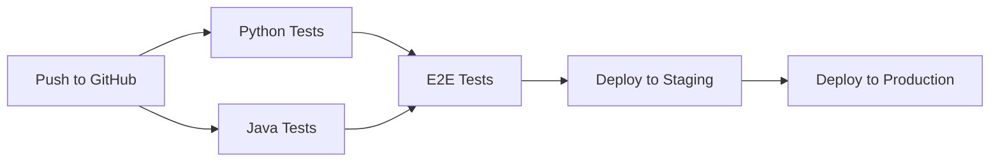

# DevOps Guide: Complete CI/CD, Testing, and Deployment

This guide covers the complete DevOps implementation for the UConn Web Scraping Pipeline, including automated testing, continuous integration, deployment automation, and monitoring.

## Table of Contents

1. [Overview](#overview)
2. [CI/CD Pipeline](#cicd-pipeline)
3. [Testing Strategy](#testing-strategy)
4. [Database Migrations](#database-migrations)
5. [Workflow Orchestration](#workflow-orchestration)
6. [Deployment Automation](#deployment-automation)
7. [Monitoring and Alerting](#monitoring-and-alerting)

---

## Overview

The UConn scraping pipeline implements a comprehensive DevOps strategy following industry best practices:

- **Test-Driven Development (TDD)**: Write tests first, then implement features
- **Automated Testing**: Unit, integration, and E2E tests run on every commit
- **Database Migrations**: Schema changes tracked and versioned with Flyway
- **Workflow Orchestration**: DAG-based pipeline execution with Apache Airflow
- **Continuous Integration**: Parallel Python and Java testing in GitHub Actions
- **Continuous Deployment**: Automated deployments to staging and production
- **Monitoring**: Real-time metrics, logs, and alerts to multiple platforms

---

## CI/CD Pipeline

### Architecture

The CI/CD pipeline consists of three parallel jobs:



### GitHub Actions Workflows

#### 1. CI Workflow (`.github/workflows/ci-enhanced.yml`)

**Python Tests Job:**
- Runs on Ubuntu with Python 3.10, 3.11, 3.12
- Installs dependencies from `requirements.txt`
- Lints with `ruff`
- Runs pytest with coverage
- Uploads coverage report

**Java Tests Job:**
- Sets up JDK 17 with Maven cache
- Builds Java ETL loader
- Runs unit tests (JUnit + Mockito)
- Runs integration tests (Testcontainers + PostgreSQL)
- Uploads test reports

**E2E Test Job:**
- Requires both Python and Java tests to pass
- Spins up PostgreSQL container
- Runs small-scale end-to-end test
- Validates data in warehouse
- Generates test report

#### 2. Deployment Workflow (`.github/workflows/deploy.yml`)

**Staging Deployment:**
- Triggers on push to `main` branch
- Deploys Python code via rsync
- Deploys Java JAR via scp
- Runs Flyway database migrations
- Restarts services
- Runs smoke tests
- Sends Slack notification

**Production Deployment:**
- Triggers on version tags (`v*.*.*`)
- Creates backup before deployment
- Deploys to production servers
- Runs migrations
- Performs health checks
- Automatically rolls back on failure
- Sends alerts to Slack and PagerDuty

### Running CI Locally

```bash
# Run Python tests locally
pytest -v --cov=Scraping_project/src

# Run Java tests locally
cd Scraping_project/java-etl-loader
mvn test

# Run integration tests
mvn verify -Dtest=*IntegrationTest

# Run E2E test
export DATABASE_URL=jdbc:postgresql://localhost:5432/test_db
export DATABASE_USER=test
export DATABASE_PASSWORD=test
./Scraping_project/tests/e2e/run_e2e_test.sh
```

---

## Testing Strategy

### Testing Pyramid

```
        /\
       /E2E\          <- Few, expensive, full integration
      /------\
     /  INT   \       <- Some, moderate cost, real database
    /----------\
   /   UNIT     \     <- Many, cheap, fast feedback
  /--------------\
```

### 1. Unit Tests (Fast, Isolated)

**Python Unit Tests:**
```python
# Example: src/common/test_nlp.py
def test_filter_entities():
    entities = ["Valid Entity", "Too\nMany\nLines", "123456"]
    filtered = filter_entities(entities)
    assert "Valid Entity" in filtered
    assert "Too\nMany\nLines" not in filtered
```

**Java Unit Tests:**
```java
// Example: PageRepositoryTest.java
@Test
@DisplayName("Should find current page by URL hash")
void shouldFindCurrentPageByUrlHash() {
    Page page = createPage("abc123", 1, true);
    entityManager.persist(page);

    Optional<Page> found = pageRepository.findCurrentByUrlHash("abc123");

    assertThat(found).isPresent();
    assertThat(found.get().getIsCurrent()).isTrue();
}
```

### 2. Integration Tests (Real Database)

**Testcontainers for Java:**
```java
@SpringBootTest
@Testcontainers
class DatabaseIntegrationTest {

    @Container
    static PostgreSQLContainer<?> postgres =
        new PostgreSQLContainer<>("postgres:15-alpine");

    @Test
    void shouldPersistPageWithRelationships() {
        Page page = createPageWithEntities();
        Page saved = pageRepository.save(page);

        assertThat(saved.getId()).isNotNull();
        assertThat(saved.getEntities()).hasSize(2);
    }
}
```

**Benefits:**
- Tests against real PostgreSQL, not H2 or mocks
- Catches database-specific issues
- Runs in isolated Docker container
- Automatically cleaned up after tests

### 3. End-to-End Tests (Full Pipeline)

Located in `tests/e2e/run_e2e_test.sh`:

1. Creates test URLs file
2. Runs Python scraping pipeline
3. Validates scraped data structure
4. Runs Java ETL loader
5. Validates data in PostgreSQL
6. Generates test report

**Running E2E Tests:**
```bash
export DATABASE_URL=jdbc:postgresql://localhost:5432/test_db
export DATABASE_USER=test
export DATABASE_PASSWORD=test

chmod +x Scraping_project/tests/e2e/run_e2e_test.sh
./Scraping_project/tests/e2e/run_e2e_test.sh
```

---

## Database Migrations

### Flyway Migration System

Schema changes are managed with **Flyway** for versioned, repeatable migrations.

**Migration Files Location:**
```
java-etl-loader/src/main/resources/db/migration/
├── V1__initial_schema.sql
├── V2__add_vendor_metadata.sql
└── V3__add_crawl_metadata_indexes.sql
```

**Naming Convention:**
- `V{version}__{description}.sql` for versioned migrations
- `R__{description}.sql` for repeatable migrations

**Example Migration:**
```sql
-- V2__add_vendor_metadata.sql
ALTER TABLE vendor_data
ADD COLUMN metadata JSONB;

CREATE INDEX idx_vendor_metadata
ON vendor_data USING gin(metadata);
```

### Running Migrations

**Via Maven:**
```bash
cd java-etl-loader

# Run migrations
mvn flyway:migrate

# Validate migrations
mvn flyway:validate

# Get migration info
mvn flyway:info

# Repair failed migration
mvn flyway:repair
```

**Via Java Application:**
Migrations run automatically on application startup (configured in `application.yml`):
```yaml
spring:
  flyway:
    enabled: true
    baseline-on-migrate: true
    validate-on-migrate: true
```

### Migration Best Practices

1. **Never modify existing migrations** - Create new ones instead
2. **Test migrations on staging first** - Always validate before production
3. **Make migrations reversible** - Keep old columns until confirmed working
4. **Use transactions** - Wrap migrations in BEGIN/COMMIT when possible
5. **Backup before migrations** - Especially in production

---

## Workflow Orchestration

### Option 1: Apache Airflow (Recommended for Production)

**DAG Definition:** `orchestration/pipeline_dag.py`

**DAG Structure:**
```python
python_scraping_group >> java_etl_load >> validate_warehouse
validate_warehouse >> [data_quality_checks, generate_metrics]
data_quality_checks >> cleanup_old_versions
```

**Installing Airflow:**
```bash
pip install apache-airflow
airflow db init
airflow users create --username admin --password admin --role Admin

# Copy DAG to Airflow folder
cp orchestration/pipeline_dag.py ~/airflow/dags/

# Start Airflow
airflow webserver -p 8080
airflow scheduler
```

**Scheduling:**
- Default: Daily at 2 AM (`0 2 * * *`)
- Configurable in DAG definition
- Can trigger manually via Airflow UI

### Option 2: Simple Shell Script

**Script:** `orchestration/run_pipeline.sh`

**Usage:**
```bash
# Full pipeline
./orchestration/run_pipeline.sh

# Python only (skip Java)
./orchestration/run_pipeline.sh --no-java

# Validation only
./orchestration/run_pipeline.sh --validate-only
```

**Scheduling with Cron:**
```bash
# Edit crontab
crontab -e

# Add daily run at 2 AM
0 2 * * * /opt/uconn-scraper/orchestration/run_pipeline.sh >> /var/log/uconn-scraper.log 2>&1
```

---

## Deployment Automation

### Deployment Environments

| Environment | URL | Trigger | Auto-Deploy |
|-------------|-----|---------|-------------|
| Development | localhost | Manual | No |
| Staging | staging.uconn.edu | Push to `main` | Yes |
| Production | warehouse.uconn.edu | Tag `v*.*.*` | Yes (with approval) |

### Deployment Process

**1. Staging Deployment:**
```bash
# Push to main branch
git push origin main

# GitHub Actions will:
# 1. Run all tests
# 2. Build JAR
# 3. Deploy to staging
# 4. Run migrations
# 5. Restart services
# 6. Run smoke tests
# 7. Send Slack notification
```

**2. Production Deployment:**
```bash
# Create version tag
git tag -a v1.2.0 -m "Release v1.2.0"
git push origin v1.2.0

# GitHub Actions will:
# 1. Deploy to staging first
# 2. Wait for approval (if configured)
# 3. Create backup
# 4. Deploy to production
# 5. Run migrations
# 6. Health check
# 7. Rollback if failed
# 8. Send alerts
```

### Required GitHub Secrets

Configure these secrets in GitHub Settings → Secrets:

**Staging:**
- `STAGING_SSH_KEY` - SSH private key for staging server
- `STAGING_HOST` - Staging server hostname
- `STAGING_USER` - SSH username
- `STAGING_DB_URL` - Database JDBC URL
- `STAGING_DB_USER` - Database username
- `STAGING_DB_PASSWORD` - Database password

**Production:**
- `PRODUCTION_SSH_KEY`
- `PRODUCTION_HOST`
- `PRODUCTION_USER`
- `PRODUCTION_DB_URL`
- `PRODUCTION_DB_USER`
- `PRODUCTION_DB_PASSWORD`

**Monitoring:**
- `SLACK_WEBHOOK_URL` - Slack webhook for notifications

### Rollback Procedure

**Automatic Rollback:**
Production deployment automatically rolls back on failure.

**Manual Rollback:**
```bash
# SSH to production server
ssh user@production-server

# List backups
ls -lh /opt/backups/uconn-scraper-*.tar.gz

# Restore from backup
cd /opt/uconn-scraper
tar -xzf /opt/backups/uconn-scraper-20250103_020000.tar.gz

# Restart services
sudo systemctl restart uconn-scraper-scheduler

# Verify
curl http://localhost:8080/actuator/health
```

---

## Monitoring and Alerting

### Monitoring Architecture

```
Pipeline → Monitoring Hooks → [Slack, Prometheus, Datadog, PagerDuty]
```

### Supported Integrations

**1. Slack (Status Updates)**
- Pipeline start/complete/failure notifications
- Stage completion updates
- Deployment notifications

**2. Prometheus (Metrics)**
- Pipeline duration
- Pages scraped/loaded
- Success/failure rates
- Stage-level metrics

**3. Datadog (Metrics + Events)**
- Comprehensive metrics dashboard
- Event timeline
- Log aggregation

**4. PagerDuty (Critical Alerts)**
- Pipeline failures
- Data quality issues
- Deployment failures

### Configuration

**Edit:** `orchestration/monitoring_config.yml`

```yaml
slack:
  enabled: true
  webhook_url: "https://hooks.slack.com/services/YOUR/WEBHOOK"
  channel: "#data-pipeline"

prometheus:
  enabled: true
  pushgateway_url: "http://prometheus-pushgateway:9091"

pagerduty:
  enabled: true
  integration_key: "your-pagerduty-key"
```

### Using Monitoring Hooks

**In Python Pipeline:**
```python
from orchestration.monitoring_hooks import create_monitoring_manager_from_config
import yaml

# Load config
with open('orchestration/monitoring_config.yml') as f:
    config = yaml.safe_load(f)

# Create manager
monitor = create_monitoring_manager_from_config(config)

# Use hooks
context = {'run_id': '123', 'pages_scraped': 500}

monitor.on_pipeline_start(context)
# ... run pipeline ...
monitor.on_pipeline_complete(context)
```

### Metrics Dashboard

**Key Metrics to Track:**
- Pipeline success rate
- Average duration
- Pages scraped per day
- Warehouse growth rate
- Error rates by stage
- Data quality scores

**Example Prometheus Query:**
```promql
# Pipeline success rate (last 24h)
rate(uconn_scraper_pipeline_success[24h])

# Average pipeline duration
avg_over_time(uconn_scraper_pipeline_duration_seconds[7d])
```

---

## Troubleshooting

### CI/CD Pipeline Failures

**Python tests fail:**
```bash
# Check test logs in GitHub Actions
# Run locally to debug:
pytest -v --tb=long
```

**Java tests fail:**
```bash
# Check test reports
cat java-etl-loader/target/surefire-reports/*.txt

# Run specific test
mvn test -Dtest=PageRepositoryTest
```

**E2E tests fail:**
```bash
# Check test results
cat Scraping_project/tests/e2e/results/e2e_report_*.json

# Run with verbose logging
bash -x Scraping_project/tests/e2e/run_e2e_test.sh
```

### Deployment Issues

**Deployment fails:**
1. Check GitHub Actions logs
2. Verify SSH keys are correct
3. Check disk space on servers
4. Verify database credentials

**Migrations fail:**
```bash
# Check migration status
mvn flyway:info

# Repair if needed
mvn flyway:repair

# Re-run migration
mvn flyway:migrate
```

### Monitoring Issues

**Slack notifications not working:**
1. Verify webhook URL is correct
2. Check webhook permissions
3. Test webhook manually:
```bash
curl -X POST $SLACK_WEBHOOK_URL \
  -H 'Content-Type: application/json' \
  -d '{"text": "Test message"}'
```

**Metrics not appearing:**
1. Verify Prometheus Pushgateway is running
2. Check network connectivity
3. Verify job name matches configuration

---

## Summary

The UConn scraping pipeline now includes:

✅ **Automated Testing** - Unit, integration, E2E tests on every commit
✅ **Database Migrations** - Versioned schema changes with Flyway
✅ **Workflow Orchestration** - DAG-based execution with Airflow
✅ **CI/CD Pipeline** - Parallel Python/Java testing in GitHub Actions
✅ **Deployment Automation** - Automated staging and production deployments
✅ **Monitoring & Alerts** - Real-time metrics to Slack, Prometheus, Datadog, PagerDuty
✅ **Rollback Protection** - Automatic rollback on deployment failure

This implementation follows DevOps best practices and provides a production-ready, maintainable system.
